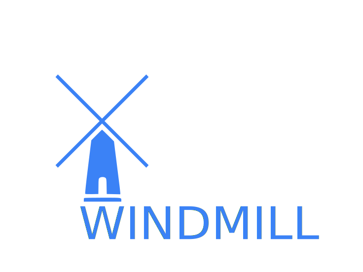
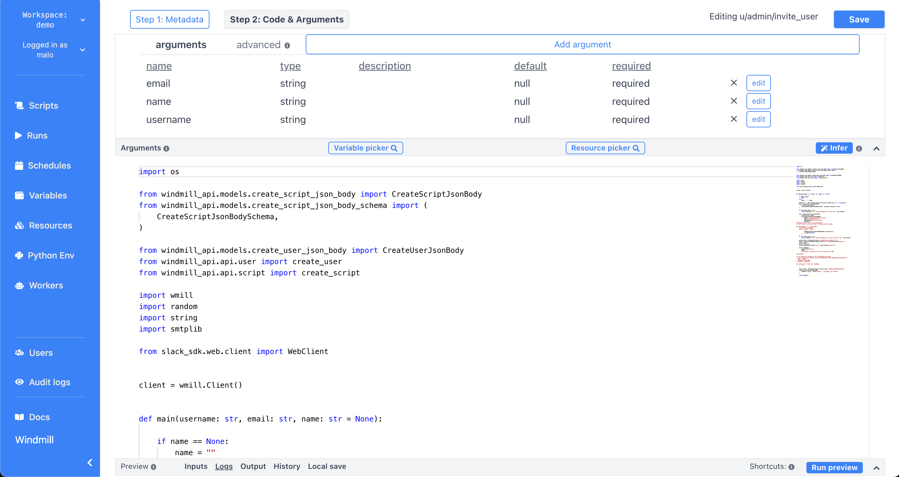

  

    <em>Windmill.dev is an OSS developer platform to quickly build production-grade multi-steps automations and internal apps from minimal Python and Typescript scripts.</em>

---

**Join the alpha (personal workspaces are free forever)**:
<https://alpha.windmill.dev>

**Documentation**: <https://docs.windmill.dev>

**Discord**: <https://discord.gg/V7PM2YHsPB>

**We are hiring**: Software Engineers, DevOps, Solutions Engineers, Growth:
<https://docs.windmill.dev/hiring>

You can show your support for the project by starring this repo.

---

# Windmill

<b>Disclaimer: </b>Windmill is in <b>BETA</b>. It is secure to run in production but the API might change,
especially concerning flows.

Windmill is <b>fully open-sourced</b>:

- `community/` and `python-client/` are Apache 2.0
- backend, frontend and everything else under AGPLv3.

## Layout

- `backend/`: The whole Rust backend
- `frontend`: The whole Svelte fronten
- `community/`: Scripts and resource types created and curated by the community,
  included in every workspace
- `lsp/`: The lsp asssistant for the monaco editor
- `nsjail/`: The nsjail configuration files for sandboxing of the scripts'
  execution
- `python-client/`: The wmill python client used within scripts to interact with
  the windmill platform

## Stack

- postgres as the database
- backend in Rust with the follwing highly-available and horizontally scalable
  architecture:
  - stateless API backend
  - workers that pull jobs from a queue
- frontend in svelte
- scripts executions are sandboxed using google's nsjail
- javascript runtime is deno_core rust library (which itself uses the rusty_v8
  and hence V8 underneath)
- typescript runtime is deno
- python runtime is python3

## Architecture

A detailed section about Windmill architecture is coming soon

### Development stack

- caddy is the reverse proxy used for local development, see frontend's
  Caddyfile and CaddyfileRemote

## How to self-host

Complete instructions coming soon

## Copyright

2021 [Ruben Fiszel](https://github.com/rubenfiszel)

### Acknowledgement

This project is inspired from a previous project called
[Delightool](https://github.com/windmill-labs/delightool-legacy) which was also
led by [Ruben](https://github.com/rubenfiszel) and with large contribution on
the frontend from [Malo Marrec](https://github.com/malomarrec) who gave his
blessing to Windmill.
