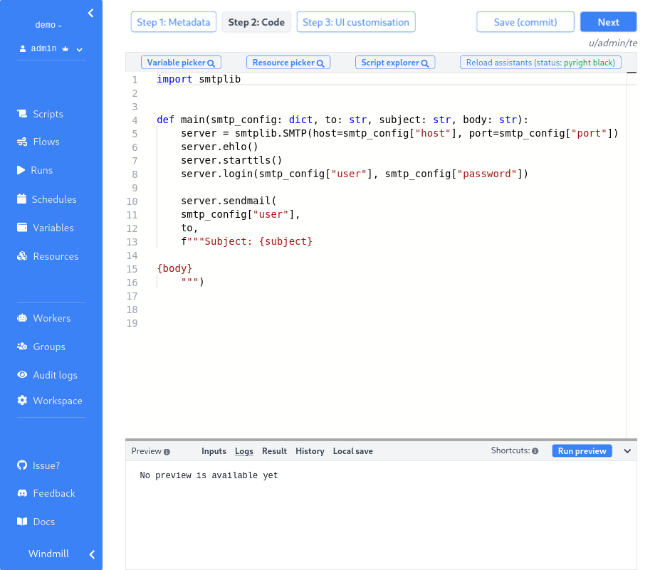
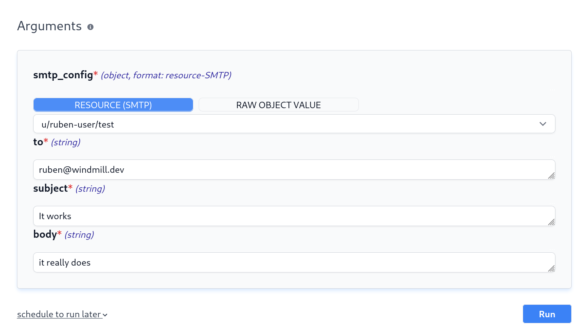
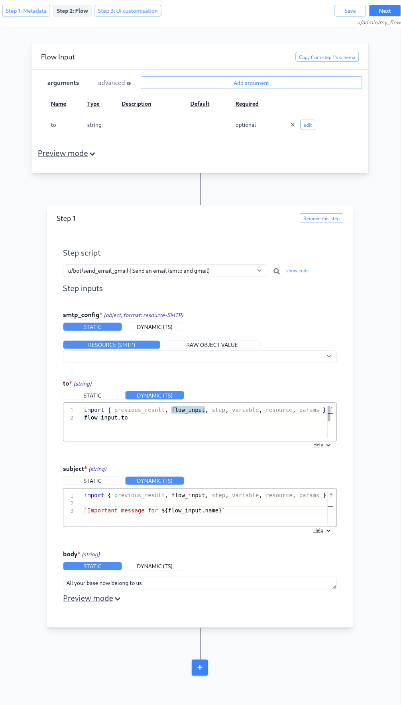

  

    <em>Windmill.dev is an OSS developer platform to quickly build production-grade multi-steps automations and internal apps from minimal Python and Typescript scripts.</em>

---

**Join the alpha (personal workspaces are free forever)**:
<https://app.windmill.dev>

**Documentation**: <https://docs.windmill.dev>

**Discord**: <https://discord.gg/V7PM2YHsPB>

**We are hiring**: Software Engineers, DevOps, Solutions Engineers, Growth:
<https://docs.windmill.dev/hiring>

You can show your support for the project by starring this repo.

---

# Windmill

<b>Disclaimer: </b>Windmill is in <b>BETA</b>. It is secure to run in production but the API might change,
especially concerning flows.

Windmill is <b>fully open-sourced</b>:

- `community/`, `python-client/` and `deno-client/` are Apache 2.0
- backend, frontend and everything else under AGPLv3.

## What is the general idea behind Windmill

1. Define a minimal and generic script in Python or Typescript that solve a
   specific task. Here sending an email with SMTP. The code can be defined in
   the provided Web IDE or synchronized with your own github repo:
   

2. Your scripts parameters are automatically parsed and generate a frontend. You
   can narrow down the types during task definition to specify regex for string,
   an enum or a specific format for objects. Each script correspond to an app by
   itself: 

3. Make it flow! You can chain your scripts or scripts made by the community
   inside flow by piping output to input using "Dynamic" fields that are just
   plain Javascript. You can also refer to external variables, output from any
   steps or inputs of the flow itself. The flow parameters then generate
   automatically an intuitive forms that can be triggered by anyone, like for
   scripts. 

## Layout

- `backend/`: The whole Rust backend
- `frontend`: The whole Svelte frontend
- `community/`: Scripts and resource types created and curated by the community,
  included in every workspace
- `lsp/`: The lsp asssistant for the monaco editor
- `nsjail/`: The nsjail configuration files for sandboxing of the scripts'
  execution
- `python-client/`: The wmill python client used within scripts to interact with
  the windmill platform
- `deno-client/`: The wmill deno client used within scripts to interact with the
  windmill platform

## Stack

- postgres as the database
- backend in Rust with the following highly-available and horizontally scalable
  architecture:
  - stateless API backend
  - workers that pull jobs from a queue
- frontend in svelte
- scripts executions are sandboxed using google's nsjail
- javascript runtime is deno_core rust library (which itself uses the rusty_v8
  and hence V8 underneath)
- typescript runtime is deno
- python runtime is python3

### Development stack

- caddy is the reverse proxy used for local development, see frontend's
  Caddyfile and CaddyfileRemote

## Architecture

## How to self-host

`docker compose up` with the following docker-compose is sufficient:
<https://github.com/windmill-labs/windmill/blob/main/docker-compose.yml>

For older kernels < 4.18, set DISABLE_NUSER to true otherwise nsjail will not be
able to launch the isolated scripts.

The default super-admin user is: admin@windmill.dev / changeme

From there, you can create other users (do not forget to change the password!)

Detailed instructions for more complex deployments will come soon. For simpler
docker based ones, the docker-compose.yml file contains all the necessary
informations.

## Contributors

## Copyright

2021 [Ruben Fiszel](https://github.com/rubenfiszel)

### Acknowledgement

This project is inspired from a previous project called
[Delightool](https://github.com/windmill-labs/delightool-legacy) which was also
led by [Ruben](https://github.com/rubenfiszel) and with large contribution on
the frontend from [Malo Marrec](https://github.com/malomarrec) who gave his
blessing to Windmill.
