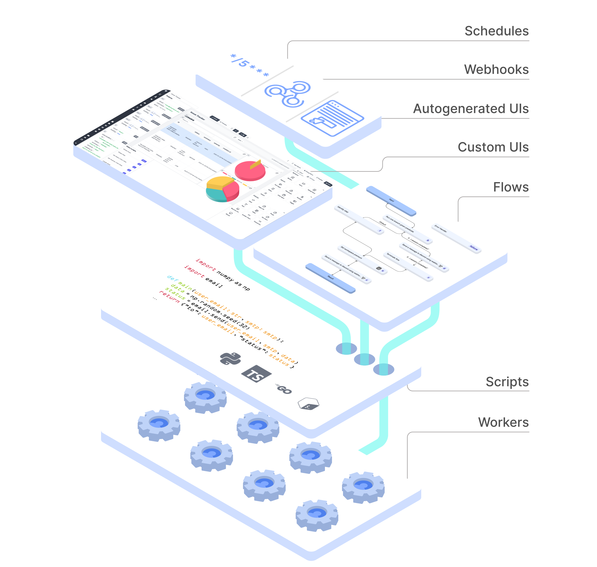

<p align="center">
  <a href="https://www.windmill.dev/"></a>
</p>
<p align=center>
Open-source developer infrastructure for internal tools (APIs, background jobs, workflows and UIs). Self-hostable alternative to Airplane, Pipedream, Superblocks and a simplified Temporal with autogenerated UIsm and custom UIs to trigger workflows and scripts as internal apps.

<p align=center>
Scripts are turned into UIs and no-code modules, no-code modules can be composed into rich flows, and script and flows can be triggered from internal UIs made with a low-code builder. Supported script languages supported are: Python, TypeScript, Go, Bash, SQL.
</p>

<p align="center">
<a href="https://github.com/windmill-labs/windmill/blob/main/LICENSE-AGPL" target="_blank">
    
</a>
<a href="https://github.com/windmill-labs/windmill/actions/workflows/docker-image.yml" target="_blank">
    
</a>
<a href="https://pypi.org/project/wmill" target="_blank">
    
</a>
</p>

<p align="center">
<a href="https://img.shields.io/github/commit-activity/m/windmill-labs/windmill" target="_blank">
    
</a>
<a href="https://discord.gg/V7PM2YHsPB" target="_blank">
  
</a>
</p>

<p align="center">
  <a href="https://app.windmill.dev">Try it</a> - <a href="https://www.windmill.dev/docs/intro/">Docs</a> - <a href="https://discord.gg/V7PM2YHsPB">Discord</a> - <a href="https://hub.windmill.dev">Hub</a> - <a href="https://www.windmill.dev/docs/misc/contributing">Contributor's guide</a>
</p>

# Windmill - Developer platform for APIs, background jobs, workflows and UIs

Windmill is <b>fully open-sourced (AGPLv3)</b> and Windmill Labs offers
dedicated instance and commercial support and licenses.



https://github.com/windmill-labs/windmill/assets/122811744/0b132cd1-ee67-4505-822f-0c7ee7104252

- [Windmill - Developer platform for APIs, background jobs, workflows and UIs](#windmill---developer-platform-for-apis-background-jobs-workflows-and-uis)
  - [Main Concepts](#main-concepts)
  - [Show me some actual script code](#show-me-some-actual-script-code)
  - [CLI](#cli)
    - [Running scripts locally](#running-scripts-locally)
  - [Stack](#stack)
  - [Fastest Self-Hostable Workflow Engine](#fastest-self-hostable-workflow-engine)
  - [Security](#security)
    - [Sandboxing](#sandboxing)
    - [Secrets, credentials and sensitive values](#secrets-credentials-and-sensitive-values)
  - [Performance](#performance)
  - [Architecture](#architecture)
  - [How to self-host](#how-to-self-host)
    - [Docker compose](#docker-compose)
    - [Kubernetes (k8s) and Helm charts](#kubernetes-k8s-and-helm-charts)
    - [Run from binaries](#run-from-binaries)
    - [OAuth, SSO \& SMTP](#oauth-sso--smtp)
    - [Commercial license](#commercial-license)
    - [Integrations](#integrations)
  - [Environment Variables](#environment-variables)
  - [Run a local dev setup](#run-a-local-dev-setup)
    - [only Frontend](#only-frontend)
    - [Backend + Frontend](#backend--frontend)
  - [Contributors](#contributors)
  - [Copyright](#copyright)

## Main Concepts

1. Define a minimal and generic script in Python, TypeScript, Go or Bash that
   solves a specific task. The code can be defined
   in the [provided Web IDE](https://www.windmill.dev/docs/code_editor) or [synchronized with your own GitHub repo](https://www.windmill.dev/docs/advanced/cli/sync) (e.g. through [VS Code](https://www.windmill.dev/docs/cli_local_dev/vscode-extension) extension):

   

2. Your scripts parameters are automatically parsed and [generate a frontend](https://www.windmill.dev/docs/core_concepts/auto_generated_uis).

  
  
  

3. Make it [flow](https://www.windmill.dev/docs/flows/flow_editor)! You can chain your scripts or scripts made by the community
   shared on [WindmillHub](https://hub.windmill.dev).

   

4. Build [complex UIs](https://www.windmill.dev/docs/apps/app_editor) on top of your scripts and flows.

   

Scripts and flows can also be triggered by a [cron schedule](https://www.windmill.dev/docs/core_concepts/scheduling) (e.g. '_/5 _ \* \* \*') or
through [webhooks](https://www.windmill.dev/docs/core_concepts/webhooks).

You can build your entire infra on top of Windmill!

## Show me some actual script code

```typescript
//import any dependency  from npm
import * as wmill from "https://deno.land/x/windmill@v1.136.0/mod.ts";
import cowsay from "npm:cowsay@1.5.0";

// fill the type, or use the +Resource type to get a type-safe reference to a resource
type Postgresql = {
  host: string;
  port: number;
  user: string;
  dbname: string;
  sslmode: string;
  password: string;
};

export async function main(
  a: number,
  b: "my" | "enum",
  c: Postgresql,
  d = "inferred type string from default arg",
  e = { nested: "object" }
  //f: wmill.Base64
) {
  const email = Deno.env.get("WM_EMAIL");
  // variables are permissioned and by path
  let variable = await wmill.getVariable("f/company-folder/my_secret");
  const lastTimeRun = await wmill.getState();
  // logs are printed and always inspectable
  console.log(cowsay.say({ text: "hello " + email + " " + lastTimeRun }));
  await wmill.setState(Date.now());

  // return is serialized as JSON
  return { foo: d, variable };
}
```

## CLI

We have a powerful CLI to interact with the windmill platform and sync your
scripts from local files, github repos and to run scripts and flows on the
instance from local commands. See
[more details](https://github.com/windmill-labs/windmill/tree/main/cli).


### Running scripts locally

You can run your script locally easily, you simply need to pass the right
environment variables for the `wmill` client library to fetch resources and
variables from your instance if necessary. See more:
<https://www.windmill.dev/docs/advanced/local_development>.

To develop & test locally scripts & flows, we recommend using the Windmill VS Code extension: <https://www.windmill.dev/docs/cli_local_dev/vscode-extension>.

## Stack

- Postgres as the database
- backend in Rust with the following highly-available and horizontally scalable
  architecture:
  - stateless API backend
  - workers that pull jobs from a queue in Postgres (and later, Kafka or Redis.
    Upvote [#173](#https://github.com/windmill-labs/windmill/issues/173) if
    interested )
- frontend in Svelte
- scripts executions are sandboxed using google's
  [nsjail](https://github.com/google/nsjail)
- javascript runtime is the
  [deno_core rust library](https://denolib.gitbook.io/guide/) (which itself uses
  the [rusty_v8](https://github.com/denoland/rusty_v8) and hence V8 underneath)
- typescript runtime is deno
- python runtime is python3
- golang runtime is 1.19.1

## Fastest Self-Hostable Workflow Engine

We have compared Windmill to other self-hostable workflow engines (Airflow, Prefect & Temporal) and Windmill is the most performant solution for both benchmarks: one flow composed of 40 lightweight tasks & one flow composed of 10 long-running tasks.

All methodology & results on our [Benchmarks](https://www.windmill.dev/docs/misc/benchmarks/competitors#airflow-setup) page.


## Security

### Sandboxing

Windmill uses [nsjail](https://github.com/google/nsjail) and deno's sandboxing
capabilities. It is production multi-tenant grade secure. Do not take our word
for it, take
[fly.io's one](https://fly.io/blog/sandboxing-and-workload-isolation/).

### Secrets, credentials and sensitive values

There is one encryption key per workspace to encrypt the credentials and secrets
stored in Windmill's K/V store.

In addition, we strongly recommend that you encrypt the whole Postgres database.
That is what we do at <https://app.windmill.dev>.

## Performance

Once a job started, there is no overhead compared to running the same script on
the node with its corresponding runner (Deno/Go/Python/Bash). The added latency
from a job being pulled from the queue, started, and then having its result sent
back to the database is ~50ms. A typical lightweight deno job will take around
100ms total.

## Architecture

<p align="center">


</p>

## How to self-host

We only provide docker-compose setup here. For more advanced setups, like
compiling from source or using without a postgres super user, see
[Self-Host documentation](https://www.windmill.dev/docs/advanced/self_host).

### Docker compose

Windmill can be deployed using 3 files: ([docker-compose.yml](./docker-compose.yml), [Caddyfile](./Caddyfile) and a [.env](./.env)) in a single command.

Make sure Docker is started, and run:

```
curl https://raw.githubusercontent.com/windmill-labs/windmill/main/docker-compose.yml -o docker-compose.yml
curl https://raw.githubusercontent.com/windmill-labs/windmill/main/Caddyfile -o Caddyfile
curl https://raw.githubusercontent.com/windmill-labs/windmill/main/.env -o .env

docker compose up -d
```

Go to http://localhost et voilà :)

The default super-admin user is: admin@windmill.dev / changeme.

From there, you can follow the setup app and create other users.

More details in [Self-Host Documention](https://www.windmill.dev/docs/advanced/self_host#docker).

### Kubernetes (k8s) and Helm charts

We publish helm charts at:
<https://github.com/windmill-labs/windmill-helm-charts>.

### Run from binaries

Each release includes the corresponding binaries for x86_64. You can simply
download the latest `windmill` binary using the following set of bash commands.

```bash
BINARY_NAME='windmill-amd64' # or windmill-ee-amd64 for the enterprise edition
LATEST_RELEASE=$(curl -L -s -H 'Accept: application/json' https://github.com/windmill-labs/windmill/releases/latest)
LATEST_VERSION=$(echo $LATEST_RELEASE | sed -e 's/.*"tag_name":"\([^"]*\)".*/\1/')
ARTIFACT_URL="https://github.com/windmill-labs/windmill/releases/download/$LATEST_VERSION/$BINARY_NAME"
wget "$ARTIFACT_URL" -O windmill
```

### OAuth, SSO & SMTP

Windmill Community Edition allows to configure the OAuth, SSO (including Google
Workspace SSO, Microsoft/Azure and Okta) directly from the UI in the superadmin
settings. Do note that there is a limit of 50 SSO users on the community
edition.

[See documentation](https://www.windmill.dev/docs/misc/setup_oauth).

### Commercial license

To self-host Windmill, you must respect the terms of the [AGPLv3 license](https://www.gnu.org/licenses/agpl-3.0.en.html) which
you do not need to worry about for personal uses. For business uses, you should
be fine if you do not re-expose Windmill in any way to your users and are
comfortable with AGPLv3.

To [re-expose any Windmill parts to your users](https://www.windmill.dev/docs/misc/white_labelling) as a feature of your product, or
to build a feature on top of Windmill, to comply with AGPLv3 your product must
be AGPLv3 or you must get a commercial license. Contact us at
<ruben@windmill.dev> if you have any doubts.

In addition, a commercial license grants you a dedicated engineer to transition
your current infrastructure to Windmill, support with tight SLA, and our global
cache sync for high-performance/no dependency cache miss of cluster from 10+
nodes to 200+ nodes.

### Integrations

In Windmill, integrations are referred to as [resources and resource types](https://www.windmill.dev/docs/core_concepts/resources_and_types). Each Resource has a Resource Type that defines the schema that the resource needs to implement.

On self-hosted instances, you might want to import all the approved resource types from
[WindmillHub](https://hub.windmill.dev). A setup script will prompt you to have
it being synced automatically everyday.

## Environment Variables

| Environment Variable name                     | Default                                    | Description                                                                                                                                                                                        | Api Server/Worker/All |
| --------------------------------------------- | ------------------------------------------ | -------------------------------------------------------------------------------------------------------------------------------------------------------------------------------------------------- | --------------------- |
| DATABASE_URL                                  |                                            | The Postgres database url.                                                                                                                                                                         | All                   |
| WORKER_GROUP                                  | default                                    | The worker group the worker belongs to and get its configuration pulled from                                                                                                                       | Worker                |
| MODE                                          | standalone                                 | The mode if the binary. Possible values: standalone, worker, server                                                                                                                                | All                   |
| SERVER_BIND_ADDR                              | 0.0.0.0                                    | IP Address on which to bind listening socket                                                                                                                                                       | Server                |
| PORT                                          | 8000                                       | Exposed port                                                                                                                                                                                       | Server                |
| METRICS_ADDR                                  | None                                       | (ee only) The socket addr at which to expose Prometheus metrics at the /metrics path. Set to "true" to expose it on port 8001                                                                      | All                   |
| JSON_FMT                                      | false                                      | Output the logs in json format instead of logfmt                                                                                                                                                   | All                   |
| BASE_URL                                      | http://localhost:8000                      | The base url that is exposed publicly to access your instance. Is overriden by the instance settings if any.                                                                                       | Server                |
| TIMEOUT                                       | 60 _ 60 _ 24 \* 7 (1 week)                 | The maximum time of execution of a script. When reached, the job is failed as having timedout.                                                                                                     |
| SCRIPT_TOKEN_EXPIRY                           | 900                                        | The default duration period of the ephemeral-token generated at the beginning of a script                                                                                                          | Worker                |
| ZOMBIE_JOB_TIMEOUT                            | 30                                         | The timeout after which a job is considered to be zombie if the worker did not send pings about processing the job (every server check for zombie jobs every 30s)                                  | Server                |
| RESTART_ZOMBIE_JOBS                           | true                                       | If true then a zombie job is restarted (in-place with the same uuid and some logs), if false the zombie job is failed                                                                              | Server                |
| SLEEP_QUEUE                                   | 50                                         | The number of ms to sleep in between the last check for new jobs in the DB. It is multiplied by NUM_WORKERS such that in average, for one worker instance, there is one pull every SLEEP_QUEUE ms. | Worker                |
| MAX_LOG_SIZE                                  | 500000                                     | The maximum number of characters a job can emit (log + result)                                                                                                                                     | Worker                |
| DISABLE_NUSER                                 | false                                      | If Nsjail is enabled, disable the nsjail's `clone_newuser` setting                                                                                                                                 | Worker                |
| KEEP_JOB_DIR                                  | false                                      | Keep the job directory after the job is done. Useful for debugging.                                                                                                                                | Worker                |
| LICENSE_KEY (EE only)                         | None                                       | License key checked at startup for the Enterprise Edition of Windmill                                                                                                                              | Worker                |
| S3_CACHE_BUCKET (EE only)                     | None                                       | The S3 bucket to sync the cache of the workers to                                                                                                                                                  | Worker                |
| TAR_CACHE_RATE (EE only)                      | 100                                        | The rate at which to tar the cache of the workers. 100 means every 100th job in average (uniformly randomly distributed).                                                                          | Worker                |
| SLACK_SIGNING_SECRET                          | None                                       | The signing secret of your Slack app. See [Slack documentation](https://api.slack.com/authentication/verifying-requests-from-slack)                                                                | Server                |
| COOKIE_DOMAIN                                 | None                                       | The domain of the cookie. If not set, the cookie will be set by the browser based on the full origin                                                                                               | Server                |
| DENO_PATH                                     | /usr/bin/deno                              | The path to the deno binary.                                                                                                                                                                       | Worker                |
| PYTHON_PATH                                   | /usr/local/bin/python3                     | The path to the python binary.                                                                                                                                                                     | Worker                |
| GO_PATH                                       | /usr/bin/go                                | The path to the go binary.                                                                                                                                                                         | Worker                |
| GOPRIVATE                                     |                                            | The GOPRIVATE env variable to use private go modules                                                                                                                                               | Worker                |
| GOPROXY                                       |                                            | The GOPROXY env variable to use                                                                                                                                                                    | Worker                |
| NETRC                                         |                                            | The netrc content to use a private go registry                                                                                                                                                     | Worker                |
| PIP_INDEX_URL                                 | None                                       | The index url to pass for pip.                                                                                                                                                                     | Worker                |
| PIP_EXTRA_INDEX_URL                           | None                                       | The extra index url to pass to pip.                                                                                                                                                                | Worker                |
| PIP_TRUSTED_HOST                              | None                                       | The trusted host to pass to pip.                                                                                                                                                                   | Worker                |
| PATH                                          | None                                       | The path environment variable, usually inherited                                                                                                                                                   | Worker                |
| HOME                                          | None                                       | The home directory to use for Go and Bash , usually inherited                                                                                                                                      | Worker                |
| DATABASE_CONNECTIONS                          | 50 (Server)/3 (Worker)                     | The max number of connections in the database connection pool                                                                                                                                      | All                   |
| SUPERADMIN_SECRET                             | None                                       | A token that would let the caller act as a virtual superadmin superadmin@windmill.dev                                                                                                              | Server                |
| TIMEOUT_WAIT_RESULT                           | 20                                         | The number of seconds to wait before timeout on the 'run_wait_result' endpoint                                                                                                                     | Worker                |
| QUEUE_LIMIT_WAIT_RESULT                       | None                                       | The number of max jobs in the queue before rejecting immediately the request in 'run_wait_result' endpoint. Takes precedence on the query arg. If none is specified, there are no limit.           | Worker                |
| DENO_AUTH_TOKENS                              | None                                       | Custom DENO_AUTH_TOKENS to pass to worker to allow the use of private modules                                                                                                                      | Worker                |
| DENO_FLAGS                                    | None                                       | Override the flags passed to deno (default --allow-all) to tighten permissions. Minimum permissions needed are "--allow-read=args.json --allow-write=result.json"                                  | Worker                |
| DENO_EXTRA_IMPORT_MAP                         | None                                       | extra import map to use to run deno scripts (format: `key=value,key=value`)                                                                                                                        | Worker                |
| NPM_CONFIG_REGISTRY                           | None                                       | Registry to use for NPM dependencies, set if you have a private repository you need to use instead of the default public NPM registry                                                              | Worker                |
| PIP_LOCAL_DEPENDENCIES                        | None                                       | Specify dependencies that are installed locally and do not need to be solved nor installed again                                                                                                   |                       |
| ADDITIONAL_PYTHON_PATHS                       | None                                       | Specify python paths (separated by a :) to be appended to the PYTHONPATH of the python jobs. To be used with PIP_LOCAL_DEPENDENCIES to use python codebases within Windmill                        | Worker                |
| INCLUDE_HEADERS                               | None                                       | Whitelist of headers that are passed to jobs as args (separated by a comma)                                                                                                                        | Server                |
| NUM_WORKERS                                   | 1                                          | The number of worker per Worker instance (Set to 0 for API/Server instances, Set to 1 for normal workers, and > 1 for workers dedicated to native jobs)                                            | Worker                |
| INSTANCE_EVENTS_WEBHOOK                       | None                                       | Webhook to notify of events such as new user added, signup/invite. Can hook back to windmill to send emails                                                                                        |
| GLOBAL_CACHE_INTERVAL                         | 10\*60                                     | (Enterprise Edition only) Interval in seconds in between bucket sync of the cache. This interval \* 2 is the time at which you're guaranteed all the worker's caches are synced together.          | Worker                |
| WORKER_TAGS                                   | 'deno,go,python3,bash,flow,hub,dependency' | The worker groups assigned to that workers                                                                                                                                                         | Worker                |
| DEDICATED_WORKER                              | None                                       | Unique script to run on that worker. Has to be in the form of `<workspace>:<script_path>`                                                                                                            | Worker                |
| CUSTOM_TAGS                                   | None                                       | The custom tags assignable to scripts.                                                                                                                                                             | Server                |
| JOB_RETENTION_SECS                            | 60*60*24\*60 //60 days                     | **Overriden by the instance settings UI** The time in seconds after which jobs get deleted. Set to 0 or -1 to never delete                                                                         |
| WAIT_RESULT_FAST_POLL_INTERVAL_MS             | 50                                         | The time in between polling for the run_wait_result endpoints in fast poll mode                                                                                                                    | Server                |
| WAIT_RESULT_SLOW_POLL_INTERVAL_MS             | 200                                        | The time in between polling for the run_wait_result endpoints in fast poll mode                                                                                                                    | Server                |
| WAIT_RESULT_FAST_POLL_DURATION_SECS           | 2                                          | The duration of fast poll mode before switching to slow poll                                                                                                                                       | Server                |
| EXIT_AFTER_NO_JOB_FOR_SECS                    | None                                       | Exit worker if no job is received after duration in secs if defined                                                                                                                                | Worker                |
| OAUTH_JSON_AS_BASE64                          | None                                       | Base64 encoded JSON of the OAuth configuration. e.g `OAUTH_JSON_AS_BASE64=$(base64 oauth.json \| tr -d '\n')` to encode it                                                                         | Server                |
| REQUEST_SIZE_LIMIT                            | 2097152 (2MB)                              | Max request size which impact the maximum size of resources and payload size of job args                                                                                                           | Server                |
| ACCEPT_INVALID_CERTS                          | false                                      | Accept invalid certificates, including self-signed and expired certificates                                                                                                                        | Server                |
| HTTP_PROXY                                    | None                                       | http_proxy                                                                                                                                                                                         | Server + Worker       |
| HTTPS_PROXY                                   | None                                       | https_proxy                                                                                                                                                                                        | Server + Worker       |
| NO_PROXY                                      | None                                       | no_proxy                                                                                                                                                                                           | Server + Worker       |
| SMTP_FROM                                     | None                                       | the address to use as the from field for emails send                                                                                                                                               | Server                |
| SMTP_HOST                                     | None                                       | host for the smtp server to send invite emails                                                                                                                                                     | Server                |
| SMTP_PORT                                     | 587                                        | port for the smtp server to send invite emails                                                                                                                                                     | Server                |
| SMTP_USERNAME                                 | None                                       | username for the smtp server to send invite emails                                                                                                                                                 | Server                |
| SMTP_PASSWORD                                 | None                                       | password for the smtp server to send invite emails                                                                                                                                                 | Server                |
| SMTP_TLS_IMPLICIT                             | false                                      | https://docs.rs/mail-send/latest/mail_send/struct.SmtpClientBuilder.html#method.implicit_tlsemails                                                                                                 | Server                |
| CREATE_WORKSPACE_REQUIRE_SUPERADMIN           | true                                       | If true, only superadmin can create workspaces                                                                                                                                                     | Server                |
| GLOBAL_ERROR_HANDLER_PATH_IN_ADMINS_WORKSPACE | None                                       | Path to a script or flow to run when a root job fails. The path needs to be prefixed with either `script/` or `flow/` to indicate the kind of error handler being used (assuming `script/` by default). The error handler will be run in and from the admins workspace                                                                                             | Server                |
| WHITELIST_ENVS                                | None                                       | List of envs variables, separated by a ',' that are whitelisted as being safe to passthrough the workers                                                                                           | Worker                |
| SAML_METADATA                                 | None                                       | SAML Metadata URL to enable SAML SSO (EE only)                                                                                                                                                     | Server                |
| SECRET_SALT                                   | None                                       | Secret Salt used for encryption and decryption of secrets. If defined, the secrets will not be decryptable unless the right salt is passed in, which is the case for the workers and the server    | Server + Worker       |
| OPENAI_AZURE_BASE_PATH                        | None                                       | Azure OpenAI path to be used instead of the OpenAI path. All Windmill AI features will run on the specified deployed model. Format: `https://{your-resource-name}.openai.azure.com/openai/deployments/{deployment-id}`     | Server                |
| DISABLE_EMBEDDING                             | false                                      | Disable local embedding search of hub scripts                                                                                                                                                      | Server                |
| DISABLE_NSJAIL                                | true                                       | Disable Nsjail Sandboxing                                                                                                                                                                          | Worker                |
| DISABLE_SERVER                                | false                                      | Disable the external API, operate as a worker only instance                                                                                                                                        | Worker                |

## Run a local dev setup

### only Frontend

This will use the backend of <https://app.windmill.dev> but your own frontend
with hot-code reloading.

1. Go to `frontend/`:
   1. `npm install`
   2. `npm run generate-backend-client`
   3. `npm run dev`
2. Et voilà, windmill should be available at `http://localhost:3000/`

### Backend + Frontend

See the [./frontend/README_DEV.md](./frontend/README_DEV.md) file for all
running options.

1. Create a Postgres Database for Windmill and create an admin role inside your
   Postgres setup. The easiest way to get a working postgres is running
   `cargo install --version ^0.7 sqlx-cli && sqlx migrate run`. This will also
   avoid compile time issue with sqlx's `query!` macro
2. Install [nsjail](https://github.com/google/nsjail) and have it accessible in
   your PATH
3. Install deno and python3, have the bins at `/usr/bin/deno` and
   `/usr/local/bin/python3`
4. Install [caddy](https://caddyserver.com)
5. Go to `frontend/`:
   1. `npm install`, `npm run generate-backend-client` then `npm run dev`
   2. In another shell `npm run build` otherwise the backend will not find the
      `frontend/build` folder and will crash
   3. In another shell `sudo caddy run --config Caddyfile`
6. Go to `backend/`:
   `DATABASE_URL=<DATABASE_URL_TO_YOUR_WINDMILL_DB> RUST_LOG=info cargo run`
7. Et voilà, windmill should be available at `http://localhost/`

## Contributors

<a href="https://github.com/windmill-labs/windmill/graphs/contributors">
  
</a>

## Copyright

Windmill Labs, Inc 2023
