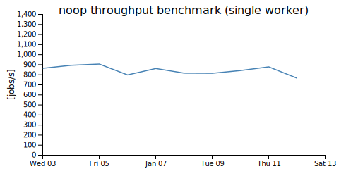
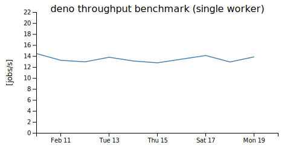
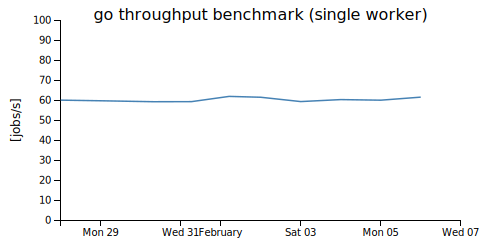
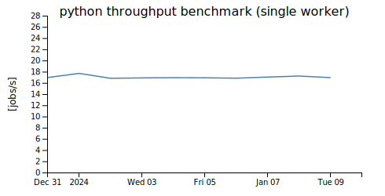
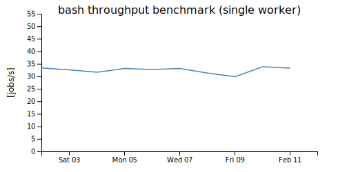

# windmill
Open-source developer platform to turn scripts into workflows and UIs. Open-source alternative to Airplane and Retool.

## benchmarks

 (bash benchmark includes a 20 ms sleep to process stdout)
