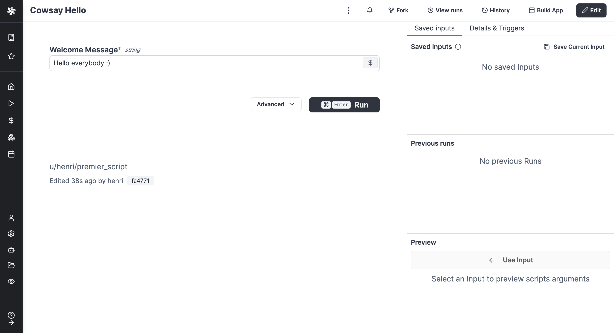
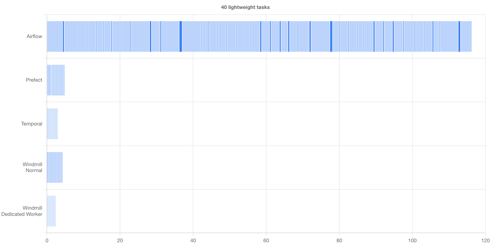

<p align="center">
  <a href="https://www.windmill.dev/"></a>
</p>

<p align=center>
Open-source developer infrastructure for internal tools (APIs, background jobs, workflows and UIs). Self-hostable alternative to Retool, Pipedream, Superblocks and a simplified Temporal with autogenerated UIs and custom UIs to trigger workflows and scripts as internal apps.

<p align=center>
Scripts are turned into sharable UIs automatically, and can be composed together into flows or used into richer apps built with low-code. Supported script languages supported are: Python, TypeScript, Go, Bash, SQL, and GraphQL.
</p>

<p align="center">
<a href="https://github.com/windmill-labs/windmill/blob/main/LICENSE-AGPL" target="_blank">
    
</a>
<a href="https://github.com/windmill-labs/windmill/actions/workflows/docker-image.yml" target="_blank">
    
</a>
<a href="https://pypi.org/project/wmill" target="_blank">
    
</a>
</p>

<p align="center">
<a href="https://img.shields.io/github/commit-activity/m/windmill-labs/windmill" target="_blank">
    
</a>
<a href="https://discord.gg/V7PM2YHsPB" target="_blank">
  
</a>
</p>

<p align="center">
  <a href="https://app.windmill.dev">Try it</a> - <a href="https://www.windmill.dev/docs/intro/">Docs</a> - <a href="https://discord.gg/V7PM2YHsPB">Discord</a> - <a href="https://hub.windmill.dev">Hub</a> - <a href="https://www.windmill.dev/docs/misc/contributing">Contributor's guide</a>
</p>

# Windmill - Developer platform for APIs, background jobs, workflows and UIs

Windmill is <b>fully open-sourced (AGPLv3)</b> and Windmill Labs offers
dedicated instance and commercial support and licenses.


https://github.com/windmill-labs/windmill/assets/122811744/0b132cd1-ee67-4505-822f-0c7ee7104252

- [Windmill - Developer platform for APIs, background jobs, workflows and UIs](#windmill---developer-platform-for-apis-background-jobs-workflows-and-uis)
  - [Main Concepts](#main-concepts)
  - [Show me some actual script code](#show-me-some-actual-script-code)
  - [CLI](#cli)
    - [Running scripts locally](#running-scripts-locally)
  - [Stack](#stack)
  - [Fastest Self-Hostable Workflow Engine](#fastest-self-hostable-workflow-engine)
  - [Security](#security)
    - [Sandboxing](#sandboxing)
    - [Secrets, credentials and sensitive values](#secrets-credentials-and-sensitive-values)
  - [Performance](#performance)
  - [Architecture](#architecture)
  - [How to self-host](#how-to-self-host)
    - [Docker compose](#docker-compose)
    - [Kubernetes (k8s) and Helm charts](#kubernetes-k8s-and-helm-charts)
    - [Run from binaries](#run-from-binaries)
    - [OAuth, SSO \& SMTP](#oauth-sso--smtp)
    - [Commercial license](#commercial-license)
    - [Integrations](#integrations)
  - [Environment Variables](#environment-variables)
  - [Run a local dev setup](#run-a-local-dev-setup)
    - [only Frontend](#only-frontend)
    - [Backend + Frontend](#backend--frontend)
  - [Contributors](#contributors)
  - [Copyright](#copyright)

## Main Concepts

1. Define a minimal and generic script in Python, TypeScript, Go or Bash that
   solves a specific task. The code can be defined in the
   [provided Web IDE](https://www.windmill.dev/docs/code_editor) or
   [synchronized with your own GitHub repo](https://www.windmill.dev/docs/advanced/cli/sync)
   (e.g. through
   [VS Code](https://www.windmill.dev/docs/cli_local_dev/vscode-extension)
   extension):

   

2. Your scripts parameters are automatically parsed and
   [generate a frontend](https://www.windmill.dev/docs/core_concepts/auto_generated_uis).




3. Make it [flow](https://www.windmill.dev/docs/flows/flow_editor)! You can
   chain your scripts or scripts made by the community shared on
   [WindmillHub](https://hub.windmill.dev).

   

4. Build [complex UIs](https://www.windmill.dev/docs/apps/app_editor) on top of
   your scripts and flows.

   

Scripts and flows can also be triggered by a
[cron schedule](https://www.windmill.dev/docs/core_concepts/scheduling) (e.g.
'_/5 _ \* \* \*') or through
[webhooks](https://www.windmill.dev/docs/core_concepts/webhooks).

You can build your entire infra on top of Windmill!

## Show me some actual script code

```typescript
//import any dependency  from npm
import * as wmill from "windmill-client";
import * as cowsay from "cowsay@1.5.0";

// fill the type, or use the +Resource type to get a type-safe reference to a resource
type Postgresql = {
  host: string;
  port: number;
  user: string;
  dbname: string;
  sslmode: string;
  password: string;
};

export async function main(
  a: number,
  b: "my" | "enum",
  c: Postgresql,
  d = "inferred type string from default arg",
  e = { nested: "object" }
  //f: wmill.Base64
) {
  const email = process.env["WM_EMAIL"];
  // variables are permissioned and by path
  let variable = await wmill.getVariable("f/company-folder/my_secret");
  const lastTimeRun = await wmill.getState();
  // logs are printed and always inspectable
  console.log(cowsay.say({ text: "hello " + email + " " + lastTimeRun }));
  await wmill.setState(Date.now());

  // return is serialized as JSON
  return { foo: d, variable };
}
```

## CLI

We have a powerful CLI to interact with the windmill platform and sync your
scripts from local files, GitHub repos and to run scripts and flows on the
instance from local commands. See
[more details](https://www.windmill.dev/docs/advanced/cli).


### Running scripts locally

You can run your script locally easily, you simply need to pass the right
environment variables for the `wmill` client library to fetch resources and
variables from your instance if necessary. See more:
<https://www.windmill.dev/docs/advanced/local_development>.

To develop & test locally scripts & flows, we recommend using the Windmill VS
Code extension: <https://www.windmill.dev/docs/cli_local_dev/vscode-extension>.

## Stack

- Postgres as the database.
- Backend in Rust with the following highly-available and horizontally scalable.
  Architecture:
  - Stateless API backend.
  - Workers that pull jobs from a queue in Postgres (and later, Kafka or Redis.
    Upvote [#173](#https://github.com/windmill-labs/windmill/issues/173) if
    interested).
- Frontend in Svelte.
- Scripts executions are sandboxed using Google's
  [nsjail](https://github.com/google/nsjail).
- Javascript runtime is the
  [deno_core rust library](https://denolib.gitbook.io/guide/) (which itself uses
  the [rusty_v8](https://github.com/denoland/rusty_v8) and hence V8 underneath).
- TypeScript runtime is Bun and deno.
- Python runtime is python3.
- Golang runtime is 1.19.1.

## Fastest Self-Hostable Workflow Engine

We have compared Windmill to other self-hostable workflow engines (Airflow,
Prefect & Temporal) and Windmill is the most performant solution for both
benchmarks: one flow composed of 40 lightweight tasks & one flow composed of 10
long-running tasks.

All methodology & results on our
[Benchmarks](https://www.windmill.dev/docs/misc/benchmarks/competitors#airflow-setup)
page.



## Security

### Sandboxing

Windmill can use [nsjail](https://github.com/google/nsjail). It is production
multi-tenant grade secure. Do not take our word for it, take
[fly.io's one](https://fly.io/blog/sandboxing-and-workload-isolation/).

### Secrets, credentials and sensitive values

There is one encryption key per workspace to encrypt the credentials and secrets
stored in Windmill's K/V store.

In addition, we strongly recommend that you encrypt the whole Postgres database.
That is what we do at <https://app.windmill.dev>.

## Performance

Once a job started, there is no overhead compared to running the same script on
the node with its corresponding runner (Deno/Go/Python/Bash). The added latency
from a job being pulled from the queue, started, and then having its result sent
back to the database is ~50ms. A typical lightweight deno job will take around
100ms total.

## Architecture

<p align="center">


</p>

## How to self-host

We only provide docker-compose setup here. For more advanced setups, like
compiling from source or using without a postgres super user, see
[Self-Host documentation](https://www.windmill.dev/docs/advanced/self_host).

### Docker compose

Windmill can be deployed using 3 files:
([docker-compose.yml](./docker-compose.yml), [Caddyfile](./Caddyfile) and a
[.env](./.env)) in a single command.

Make sure Docker is started, and run:

```
curl https://raw.githubusercontent.com/windmill-labs/windmill/main/docker-compose.yml -o docker-compose.yml
curl https://raw.githubusercontent.com/windmill-labs/windmill/main/Caddyfile -o Caddyfile
curl https://raw.githubusercontent.com/windmill-labs/windmill/main/.env -o .env

docker compose up -d
```

Go to http://localhost et voilà :)

The default super-admin user is: admin@windmill.dev / changeme.

From there, you can follow the setup app and create other users.

More details in
[Self-Host Documention](https://www.windmill.dev/docs/advanced/self_host#docker).

### Kubernetes (k8s) and Helm charts

We publish helm charts at:
<https://github.com/windmill-labs/windmill-helm-charts>.

### Run from binaries

Each release includes the corresponding binaries for x86_64. You can simply
download the latest `windmill` binary using the following set of bash commands.

```bash
BINARY_NAME='windmill-amd64' # or windmill-ee-amd64 for the enterprise edition
LATEST_RELEASE=$(curl -L -s -H 'Accept: application/json' https://github.com/windmill-labs/windmill/releases/latest)
LATEST_VERSION=$(echo $LATEST_RELEASE | sed -e 's/.*"tag_name":"\([^"]*\)".*/\1/')
ARTIFACT_URL="https://github.com/windmill-labs/windmill/releases/download/$LATEST_VERSION/$BINARY_NAME"
wget "$ARTIFACT_URL" -O windmill
```

### OAuth, SSO & SMTP

Windmill Community Edition allows to configure the OAuth, SSO (including Google
Workspace SSO, Microsoft/Azure and Okta) directly from the UI in the superadmin
settings. Do note that there is a limit of 10 SSO users on the community
edition.

[See documentation](https://www.windmill.dev/docs/misc/setup_oauth).

### Commercial license

See the [LICENSE](https://github.com/windmill-labs/windmill/blob/main/LICENSE)
file for the full license text.

The "Community Edition" of Windmill available in the docker images hosted under
ghcr.io/windmill-labs/windmill and the github binary releases contains the files
under the AGPLv3 and Apache 2 sources but also includes proprietary and
non-public code and features which are not open source and under the following
terms: Windmill Labs, Inc. grants a right to use all the features of the
"Community Edition" for free without restrictions other than the limits and
quotas set in the software and a right to distribute the community edition as is
but not to sell, resell, serve Windmill as a managed service, modify or wrap
under any form without an explicit agreement.

The binary compilable from source code in this repository without the
"enterprise" feature flag is open-source under the
[LICENSE-AGPLv3](https://github.com/windmill-labs/windmill/blob/main/LICENSE-AGPL)
License terms and conditions.

To
[re-expose directly any Windmill parts to your users](https://www.windmill.dev/docs/misc/white_labelling)
as a feature of your product, with the exception of iframed public Windmill
"apps", or to build a feature on top of "Windmill Community Edition" that you
sell commercially or embed in a distributable product or binary, you must get a
commercial license. Contact us at <sales@windmill.dev> if you have any
questions. To do the same from the binary compiled from the source code in this
repository without the "enterprise" feature flag, you must comply with the
AGPLv3 license terms and conditions or get a commercial license from Windmill
Labs, Inc.

To use Windmill "Community Edition" as is internally in your organization, or to
use its APIs as is, you do NOT need a commercial license.

### Integrations

In Windmill, integrations are referred to as
[resources and resource types](https://www.windmill.dev/docs/core_concepts/resources_and_types).
Each Resource has a Resource Type that defines the schema that the resource
needs to implement.

On self-hosted instances, you might want to import all the approved resource
types from [WindmillHub](https://hub.windmill.dev). A setup script will prompt
you to have it being synced automatically everyday.

## Environment Variables

| Environment Variable name           | Default                | Description                                                                                                                                                                                        | Api Server/Worker/All |
| ----------------------------------- | ---------------------- | -------------------------------------------------------------------------------------------------------------------------------------------------------------------------------------------------- | --------------------- |
| DATABASE_URL                        |                        | The Postgres database url.                                                                                                                                                                         | All                   |
| WORKER_GROUP                        | default                | The worker group the worker belongs to and get its configuration pulled from                                                                                                                       | Worker                |
| MODE                                | standalone             | The mode if the binary. Possible values: standalone, worker, server, agent                                                                                                                         | All                   |
| METRICS_ADDR                        | None                   | (ee only) The socket addr at which to expose Prometheus metrics at the /metrics path. Set to "true" to expose it on port 8001                                                                      | All                   |
| JSON_FMT                            | false                  | Output the logs in json format instead of logfmt                                                                                                                                                   | All                   |
| BASE_URL                            | http://localhost:8000  | The base url that is exposed publicly to access your instance. Is overriden by the instance settings if any.                                                                                       | Server                |
| ZOMBIE_JOB_TIMEOUT                  | 30                     | The timeout after which a job is considered to be zombie if the worker did not send pings about processing the job (every server check for zombie jobs every 30s)                                  | Server                |
| RESTART_ZOMBIE_JOBS                 | true                   | If true then a zombie job is restarted (in-place with the same uuid and some logs), if false the zombie job is failed                                                                              | Server                |
| SLEEP_QUEUE                         | 50                     | The number of ms to sleep in between the last check for new jobs in the DB. It is multiplied by NUM_WORKERS such that in average, for one worker instance, there is one pull every SLEEP_QUEUE ms. | Worker                |
| KEEP_JOB_DIR                        | false                  | Keep the job directory after the job is done. Useful for debugging.                                                                                                                                | Worker                |
| LICENSE_KEY (EE only)               | None                   | License key checked at startup for the Enterprise Edition of Windmill                                                                                                                              | Worker                |
| SLACK_SIGNING_SECRET                | None                   | The signing secret of your Slack app. See [Slack documentation](https://api.slack.com/authentication/verifying-requests-from-slack)                                                                | Server                |
| COOKIE_DOMAIN                       | None                   | The domain of the cookie. If not set, the cookie will be set by the browser based on the full origin                                                                                               | Server                |
| DENO_PATH                           | /usr/bin/deno          | The path to the deno binary.                                                                                                                                                                       | Worker                |
| PYTHON_PATH                         |                        | The path to the python binary if wanting to not have it managed by uv.                                                                                                                             | Worker                |
| GO_PATH                             | /usr/bin/go            | The path to the go binary.                                                                                                                                                                         | Worker                |
| GOPRIVATE                           |                        | The GOPRIVATE env variable to use private go modules                                                                                                                                               | Worker                |
| GOPROXY                             |                        | The GOPROXY env variable to use                                                                                                                                                                    | Worker                |
| NETRC                               |                        | The netrc content to use a private go registry                                                                                                                                                     | Worker                |
| PY_CONCURRENT_DOWNLOADS             | 20                     | Sets the maximum number of in-flight concurrent python downloads that windmill will perform at any given time.                                                                                     | Worker                |
| PATH                                | None                   | The path environment variable, usually inherited                                                                                                                                                   | Worker                |
| HOME                                | None                   | The home directory to use for Go and Bash , usually inherited                                                                                                                                      | Worker                |
| DATABASE_CONNECTIONS                | 50 (Server)/3 (Worker) | The max number of connections in the database connection pool                                                                                                                                      | All                   |
| SUPERADMIN_SECRET                   | None                   | A token that would let the caller act as a virtual superadmin superadmin@windmill.dev                                                                                                              | Server                |
| TIMEOUT_WAIT_RESULT                 | 20                     | The number of seconds to wait before timeout on the 'run_wait_result' endpoint                                                                                                                     | Worker                |
| QUEUE_LIMIT_WAIT_RESULT             | None                   | The number of max jobs in the queue before rejecting immediately the request in 'run_wait_result' endpoint. Takes precedence on the query arg. If none is specified, there are no limit.           | Worker                |
| DENO_AUTH_TOKENS                    | None                   | Custom DENO_AUTH_TOKENS to pass to worker to allow the use of private modules                                                                                                                      | Worker                |
| DISABLE_RESPONSE_LOGS               | false                  | Disable response logs                                                                                                                                                                              | Server                |
| CREATE_WORKSPACE_REQUIRE_SUPERADMIN | true                   | If true, only superadmins can create new workspaces                                                                                                                                                | Server                |
| MIN_FREE_DISK_SPACE_MB              | 15000                  | Minimum amount of free space on worker. Sends critical alert if worker has less free space.                                                                                                        | Worker                |
| RUN_UPDATE_CA_CERTIFICATE_AT_START  | false                  | If true, runs CA certificate update command at startup before other initialization                                                                                                                  | All                   |
| RUN_UPDATE_CA_CERTIFICATE_PATH      | /usr/sbin/update-ca-certificates | Path to the CA certificate update command/script to run when RUN_UPDATE_CA_CERTIFICATE_AT_START is true                                                                                             | All                   |

## Run a local dev setup

Using [Nix](./frontend/README_DEV.md#nix) (Recommended).

See the [./frontend/README_DEV.md](./frontend/README_DEV.md) file for all
running options.


### only Frontend

This will use the backend of <https://app.windmill.dev> but your own frontend
with hot-code reloading. Note that you will need to use a username / password
login due to CSRF checks using a different auth provider.

In the `frontend/` directory:

1. install the dependencies with `npm install` (or `pnpm install` or `yarn`)
2. generate the windmill client:

```
npm run generate-backend-client
## on mac use
npm run generate-backend-client-mac
```

3. Run your dev server with `npm run dev`
4. Et voilà, windmill should be available at `http://localhost/`

### Backend + Frontend

See the [./frontend/README_DEV.md](./frontend/README_DEV.md) file for all
running options.

1. Create a Postgres Database for Windmill and create an admin role inside your
   Postgres setup. The easiest way to get a working db is to run
   ```
   cargo install sqlx-cli
   env DATABASE_URL=<YOUR_DATABASE_URL> sqlx migrate run
   ```
   This will also avoid compile time issue with sqlx's `query!` macro
2. Install [nsjail](https://github.com/google/nsjail) and have it accessible in
   your PATH
3. Install deno and python3, have the bins at `/usr/bin/deno` and
   `/usr/local/bin/python3`
4. Install [caddy](https://caddyserver.com)
5. Install the [lld linker](https://lld.llvm.org/)
6. Go to `frontend/`:
   1. `npm install`, `npm run generate-backend-client` then `npm run dev`
   2. You might need to set some extra heap space for the node runtime
      `export NODE_OPTIONS="--max-old-space-size=4096"`
   3. In another shell `npm run build` otherwise the backend will not find the
      `frontend/build` folder and will not compile.
   4. In another shell `sudo caddy run --config Caddyfile`
7. Go to `backend/`:
   `env DATABASE_URL=<DATABASE_URL_TO_YOUR_WINDMILL_DB> RUST_LOG=info cargo run`
8. Et voilà, windmill should be available at `http://localhost/`

## Contributors

<a href="https://github.com/windmill-labs/windmill/graphs/contributors">
  
</a>

## Copyright

Windmill Labs, Inc 2023
