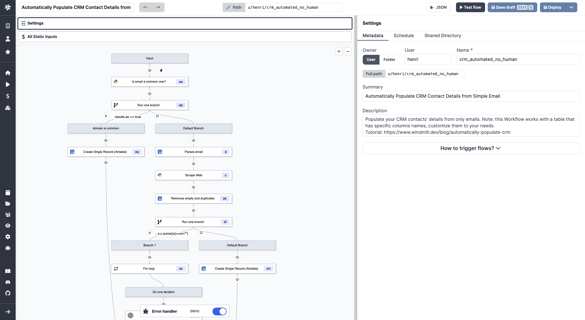

<p align="center">
  <a href="https://app.windmill.dev"></a>
</p>
<p align="center">
    <em>.</em>
</p>
<p align=center>
Open-source developer infrastructure for internal tools. Self-hostable alternative to Airplane, Pipedream, Superblocks and a simplified Temporal with autogenerated UIs to trigger workflows and scripts as internal apps. Scripts are turned into UIs and no-code modules, no-code modules can be composed into very rich flows, and script and flows can be triggered from internal UIs made with a low-code builder. The script languages supported are: Python, Typescript, Go, Bash, SQL.
</p>

<p align="center">
<a href="https://github.com/windmill-labs/windmill/actions/workflows/docker-image.yml" target="_blank">
    
</a>
<a href="https://pypi.org/project/wmill" target="_blank">
    
</a>
<a href="https://discord.gg/V7PM2YHsPB" target="_blank">
  
</a>
</p>

<p align="center">
  <a href="https://app.windmill.dev">Try it</a> - <a href="https://docs.windmill.dev/docs/intro/">Docs</a> - <a href="https://discord.gg/V7PM2YHsPB">Discord</a> - <a href="https://hub.windmill.dev">Hub</a> - <a href="https://docs.windmill.dev/docs/misc/contributing">Contributor's guide</a>
</p>

# Windmill - Turn scripts into workflows and UIs that you can share and run at scale

Windmill is <b>fully open-sourced (AGPLv3)</b> and Windmill Labs offers
dedicated instance and commercial support and licenses.


https://user-images.githubusercontent.com/275584/218350457-bc2fdc3b-e667-4da5-a2bd-3bacc1f0ec79.mp4

- [Windmill - Turn scripts into workflows and UIs that you can share and run at scale](#windmill---turn-scripts-into-workflows-and-uis-that-you-can-share-and-run-at-scale)
  - [Main Concepts](#main-concepts)
  - [Show me some actual script code](#show-me-some-actual-script-code)
  - [CLI](#cli)
    - [Running scripts locally](#running-scripts-locally)
  - [Stack](#stack)
  - [Security](#security)
    - [Sandboxing](#sandboxing)
    - [Secrets, credentials and sensitive values](#secrets-credentials-and-sensitive-values)
  - [Performance](#performance)
  - [Architecture](#architecture)
  - [How to self-host](#how-to-self-host)
    - [Docker compose](#docker-compose)
    - [Kubernetes (k8s) and Helm charts](#kubernetes-k8s-and-helm-charts)
    - [Postgres without superuser](#postgres-without-superuser)
    - [Commercial license](#commercial-license)
    - [OAuth for self-hosting](#oauth-for-self-hosting)
    - [Resource types](#resource-types)
  - [Environment Variables](#environment-variables)
  - [Run a local dev setup](#run-a-local-dev-setup)
    - [only Frontend](#only-frontend)
    - [Backend + Frontend](#backend--frontend)
  - [Contributors](#contributors)
  - [Copyright](#copyright)

## Main Concepts

1. Define a minimal and generic script in Python, Typescript, Go or Bash that
   solves a specific task. Here sending an email with SMTP. The code can be
   defined in the provided Web IDE or synchronized with your own github repo:
   

2. Your scripts parameters are automatically parsed and generate a frontend.
    

3. Make it flow! You can chain your scripts or scripts made by the community
   shared on [WindmillHub](https://hub.windmill.dev).
   

4. Build complex UI on top of your scripts and flows.
   

Scripts and flows can also be triggered by a cron schedule '_/5 _ \* \* \*' or
through webhooks.

You can build your entire infra on top of Windmill!

## Show me some actual script code

```typescript
import * as wmill from "https://deno.land/x/windmill@v1.62.0/mod.ts";
//import any dependency  from npm

import cowsay from "npm:cowsay@1.5.0";

export async function main(
  a: number,
  // unions generate enums
  b: "my" | "enum",
  // default parameters prefill the field
  d = "default arg",
  // nested objects work c = { nested: "object" },
  // permissioned and typed json
  db: wmill.Resource<"postgresql">
) {
  const email = Deno.env.get("WM_EMAIL");
  // variables are permissioned and by path
  let variable = await wmill.getVariable("f/company-folder/my_secret");
  const lastTimeRun = await wmill.getState();
  // logs are printed and always inspectable
  console.log(cowsay.say({ text: "hello " + email + " " + lastTimeRun }));
  await wmill.setState(Date.now());

  // return is serialized as JSON
  return { foo: d, variable };
}
```

## CLI

We have a powerful CLI to interact with the windmill platform and sync your
scripts from local files, github repos and to run scripts and flows on the
instance from local commands. See
[more details](https://github.com/windmill-labs/windmill/tree/main/cli)


### Running scripts locally

You can run your script locally easily, you simply need to pass the right
environment variables for the `wmill` client library to fetch resources and
variables from your instance if necessary. See more:
<https://docs.windmill.dev/docs/advanced/local_development/>

## Stack

- Postgres as the database
- backend in Rust with the following highly-available and horizontally scalable
  architecture:
  - stateless API backend
  - workers that pull jobs from a queue in Postgres (and later, Kafka or Redis.
    Upvote [#173](#https://github.com/windmill-labs/windmill/issues/173) if
    interested )
- frontend in Svelte
- scripts executions are sandboxed using google's
  [nsjail](https://github.com/google/nsjail)
- javascript runtime is the
  [deno_core rust library](https://denolib.gitbook.io/guide/) (which itself uses
  the [rusty_v8](https://github.com/denoland/rusty_v8) and hence V8 underneath)
- typescript runtime is deno
- python runtime is python3
- golang runtime is 1.19.1

## Security

### Sandboxing

Windmill uses [nsjail](https://github.com/google/nsjail) on top of the deno
sandboxing. It is production multi-tenant grade secure. Do not take our word for
it, take [fly.io's one](https://fly.io/blog/sandboxing-and-workload-isolation/)

### Secrets, credentials and sensitive values

There is one encryption key per workspace to encrypt the credentials and secrets
stored in Windmill's K/V store.

In addition, we strongly recommend that you encrypt the whole Postgres database.
That is what we do at <https://app.windmill.dev>.

## Performance

Once a job started, there is no overhead compared to running the same script on
the node with its corresponding runner (Deno/Go/Python/Bash). The added latency
from a job being pulled from the queue, started, and then having its result sent
back to the database is ~50ms. A typical lightweight deno job will take around
100ms total.

## Architecture

<p align="center">


</p>

## How to self-host

We only provide docker-compose setup here. For more advanced setups, like
compiling from source or using without a postgres super user, see
[documentation](https://docs.windmill.dev/docs/advanced/self_host)

### Docker compose

```
curl https://github.com/windmill-labs/windmill/blob/main/docker-compose.yml -o docker-compose.yml
curl https://github.com/windmill-labs/windmill/blob/main/CaddyFile -o Caddyfile
curl https://github.com/windmill-labs/windmill/blob/main/.env -o .env

docker compose up -d --pull always
```

Go to http://localhost et voilà :)

The default super-admin user is: admin@windmill.dev / changeme

From there, you can follow the setup app and creat other users.

### Kubernetes (k8s) and Helm charts

We publish helm charts at:
<https://github.com/windmill-labs/windmill-helm-charts>

### Postgres without superuser

If you do not want, or cannot (for instance, in AWS Aurora or Cloud sql) use a
postgres superuser, you can run `./init-db-as-superuser.sql` to init the
required users for windmill.

### Commercial license

To self-host Windmill, you must respect the terms of the AGPLv3 license which
you do not need to worry about for personal uses. For business uses, you should
be fine if you do not re-expose it in any way Windmill to your users and are
comfortable with AGPLv3.

To re-expose any Windmill parts to your users as a feature of your product, or
to build a feature on top of Windmill, to comply with AGPLv3 your product must
be AGPLv3 or you must get a commercial license. Contact us at
<ruben@windmill.dev> if you have any doubts.

In addition, a commercial license grants you a dedicated engineer to transition
your current infrastructure to Windmill, support with tight SLA, audit logs
export features, SSO, unlimited users creation, advanced permission managing
features such as groups and the ability to create more than one workspace.

### OAuth for self-hosting

To get the same oauth integrations as Windmill Cloud, mount `oauth.json` with
the following format:

```json
{
  "<client>": {
    "id": "<CLIENT_ID>",
    "secret": "<CLIENT_SECRET>",
    "allowed_domains": ["windmill.dev"] //restrict a client OAuth login to some domains
  }
}
```

and mount it at `/usr/src/app/oauth.json`.

The redirect url for the oauth clients is:
`<instance_url>/user/login_callback/<client>`

[The list of all possible "connect an app" oauth clients](https://github.com/windmill-labs/windmill/blob/main/backend/oauth_connect.json)

To add more "connect an app" OAuth clients to the Windmill project, read the
[Contributor's guide](https://docs.windmill.dev/docs/misc/contributing). We
welcome contributions!

You may also add your own custom OAuth2 IdP and OAuth2 Resource provider:

```json
{
  "<client>": {
    "id": "<CLIENT_ID>",
    "secret": "<CLIENT_SECRET>",
    // To add a new OAuth2 IdP
    "login_config": {
      "auth_url": "<auth_endpoint>",
      "token_url": "<token_endpoint>",
      "userinfo_url": "<userinfo endpoint>",
      "scopes": ["scope1", "scope2"],
      "extra_params": "<if_needed>"
    },
    // To add a new OAuth2 Resource
    "connect_config": {
      "auth_url": "<auth_endpoint>",
      "token_url": "<token_endpoint>",
      "scopes": ["scope1", "scope2"],
      "extra_params": "<if_needed>"
    }
  }
}
```

### Resource types

You will also want to import all the approved resource types from
[WindmillHub](https://hub.windmill.dev). A setup script will prompt you to have
it being synced automatically everyday.

## Environment Variables

| Environment Variable name | Default                | Description                                                                                                                                                                                        | Api Server/Worker/All |
| ------------------------- | ---------------------- | -------------------------------------------------------------------------------------------------------------------------------------------------------------------------------------------------- | --------------------- |
| DATABASE_URL              |                        | The Postgres database url.                                                                                                                                                                         | All                   |
| DISABLE_NSJAIL            | true                   | Disable Nsjail Sandboxing                                                                                                                                                                          | Worker                |
| SERVER_BIND_ADDR          | 0.0.0.0                | IP Address on which to bind listening socket                                                                                                                                                       | Server                |
| PORT                      | 8000                   | Exposed port                                                                                                                                                                                       | Server                |
| NUM_WORKERS               | 3                      | The number of worker per Worker instance (set to 1 on Eks to have 1 pod = 1 worker, set to 0 for an API only instance)                                                                             | Worker                |
| DISABLE_SERVER            | false                  | Binary would operate as a worker only instance                                                                                                                                                     | Worker                |
| METRICS_ADDR              | None                   | The socket addr at which to expose Prometheus metrics at the /metrics path. Set to "true" to expose it on port 8001                                                                                | All                   |
| JSON_FMT                  | false                  | Output the logs in json format instead of logfmt                                                                                                                                                   | All                   |
| BASE_URL                  | http://localhost:8000  | The base url that is exposed publicly to access your instance                                                                                                                                      | Server                |
| BASE_INTERNAL_URL         | http://localhost:8000  | The base url that is reachable by your workers to talk to the Servers. This help avoiding going through the external load balancer for VPC-internal requests.                                      | Worker                |
| TIMEOUT                   | 300                    | The maximum time of execution of a script. When reached, the job is failed as having timedout.                                                                                                     | Worker                |
| ZOMBIE_JOB_TIMEOUT        | 30                     | The timeout after which a job is considered to be zombie if the worker did not send pings about processing the job (every server check for zombie jobs every 30s)                                  | Server                |
| RESTART_ZOMBIE_JOBS       | true                   | If true then a zombie job is restarted (in-place with the same uuid and some logs), if false the zombie job is failed                                                                              | Server                |
| SLEEP_QUEUE               | 50                     | The number of ms to sleep in between the last check for new jobs in the DB. It is multiplied by NUM_WORKERS such that in average, for one worker instance, there is one pull every SLEEP_QUEUE ms. | Worker                |
| MAX_LOG_SIZE              | 500000                 | The maximum number of characters a job can emit (log + result)                                                                                                                                     | Worker                |
| DISABLE_NUSER             | false                  | If Nsjail is enabled, disable the nsjail's `clone_newuser` setting                                                                                                                                 | Worker                |
| KEEP_JOB_DIR              | false                  | Keep the job directory after the job is done. Useful for debugging.                                                                                                                                | Worker                |
| LICENSE_KEY (EE only)     | None                   | License key checked at startup for the Enterprise Edition of Windmill                                                                                                                              | Worker                |
| S3_CACHE_BUCKET (EE only) | None                   | The S3 bucket to sync the cache of the workers to                                                                                                                                                  | Worker                |
| TAR_CACHE_RATE (EE only)  | 100                    | The rate at which to tar the cache of the workers. 100 means every 100th job in average (uniformly randomly distributed).                                                                          | Worker                |
| SLACK_SIGNING_SECRET      | None                   | The signing secret of your Slack app. See [Slack documentation](https://api.slack.com/authentication/verifying-requests-from-slack)                                                                | Server                |
| COOKIE_DOMAIN             | None                   | The domain of the cookie. If not set, the cookie will be set by the browser based on the full origin                                                                                               | Server                |
| DENO_PATH                 | /usr/bin/deno          | The path to the deno binary.                                                                                                                                                                       | Worker                |
| PYTHON_PATH               | /usr/local/bin/python3 | The path to the python binary.                                                                                                                                                                     | Worker                |
| GO_PATH                   | /usr/bin/go            | The path to the go binary.                                                                                                                                                                         | Worker                |
| PIP_INDEX_URL             | None                   | The index url to pass for pip.                                                                                                                                                                     | Worker                |
| PIP_EXTRA_INDEX_URL       | None                   | The extra index url to pass to pip.                                                                                                                                                                | Worker                |
| PIP_TRUSTED_HOST          | None                   | The trusted host to pass to pip.                                                                                                                                                                   | Worker                |
| PATH                      | None                   | The path environment variable, usually inherited                                                                                                                                                   | Worker                |
| HOME                      | None                   | The home directory to use for Go and Bash , usually inherited                                                                                                                                      | Worker                |
| DATABASE_CONNECTIONS      | 50 (Server)/3 (Worker) | The max number of connections in the database connection pool                                                                                                                                      | All                   |
| SUPERADMIN_SECRET         | None                   | A token that would let the caller act as a virtual superadmin superadmin@windmill.dev                                                                                                              | Server                |
| TIMEOUT_WAIT_RESULT       | 20                     | The number of seconds to wait before timeout on the 'run_wait_result' endpoint                                                                                                                     | Worker                |
| QUEUE_LIMIT_WAIT_RESULT   | None                   | The number of max jobs in the queue before rejecting immediately the request in 'run_wait_result' endpoint. Takes precedence on the query arg. If none is specified, there are no limit.           | Worker                |
| DENO_AUTH_TOKENS          | None                   | Custom DENO_AUTH_TOKENS to pass to worker to allow the use of private modules                                                                                                                      | Worker                |
| DENO_FLAGS                | None                   | Override the flags passed to deno (default --allow-all) to tighten permissions. Minimum permissions needed are "--allow-read=args.json --allow-write=result.json"                                  | Worker                |
| NPM_CONFIG_REGISTRY       | None                   | Registry to use for NPM dependencies, set if you have a private repository you need to use instead of the default public NPM registry                                                              | Worker                |
| PIP_LOCAL_DEPENDENCIES    | None                   | Specify dependencies that are installed locally and do not need to be solved nor installed again                                                                                                   |                       |
| ADDITIONAL_PYTHON_PATHS   | None                   | Specify python paths (separated by a :) to be appended to the PYTHONPATH of the python jobs. To be used with PIP_LOCAL_DEPENDENCIES to use python codebases within Windmill                        | Worker                |
| INCLUDE_HEADERS           | None                   | Whitelist of headers that are passed to jobs as args (separated by a comma)                                                                                                                        | Server                |
| WHITELIST_WORKSPACES      | None                   | Whitelist of workspaces this worker takes job from                                                                                                                                                 | Worker                |
| BLACKLIST_WORKSPACES      | None                   | Blacklist of workspaces this worker takes job from                                                                                                                                                 | Worker                |
| NEW_USER_WEBHOOK          | None                   | Webhook to notify of a new user added, signup/invite. Can hook back to windmill to send emails                                                                                                     | Server                |

## Run a local dev setup

### only Frontend

This will use the backend of <https://app.windmill.dev> but your own frontend
with hot-code reloading.

1. Install [caddy](https://caddyserver.com)
2. Go to `frontend/`:
   1. `npm install`, `npm run generate-backend-client` then `npm run dev`
   2. In another shell `sudo caddy run --config CaddyfileRemote`
3. Et voilà, windmill should be available at `http://localhost/`

### Backend + Frontend

See the [./frontend/README_DEV.md](./frontend/README_DEV.md) file for all
running options.

1. Create a Postgres Database for Windmill and create an admin role inside your
   Postgres setup. The easiest way to get a working postgres is running
   `cargo install sqlx-cli && sqlx migrate run`. This will also avoid compile
   time issue with sqlx's `query!` macro
2. Install [nsjail](https://github.com/google/nsjail) and have it accessible in
   your PATH
3. Install deno and python3, have the bins at `/usr/bin/deno` and
   `/usr/local/bin/python3`
4. Install [caddy](https://caddyserver.com)
5. Install the [lld linker](https://lld.llvm.org/)
6. Go to `frontend/`:
   1. `npm install`, `npm run generate-backend-client` then `npm run dev`
   2. In another shell `npm run build` otherwise the backend will not find the
      `frontend/build` folder and will crash
   3. In another shell `sudo caddy run --config Caddyfile`
7. Go to `backend/`:
   `DATABASE_URL=<DATABASE_URL_TO_YOUR_WINDMILL_DB> RUST_LOG=info cargo run`
8. Et voilà, windmill should be available at `http://localhost/`

## Contributors

<a href="https://github.com/windmill-labs/windmill/graphs/contributors">
  
</a>

## Copyright

Windmill Labs, Inc 2023
