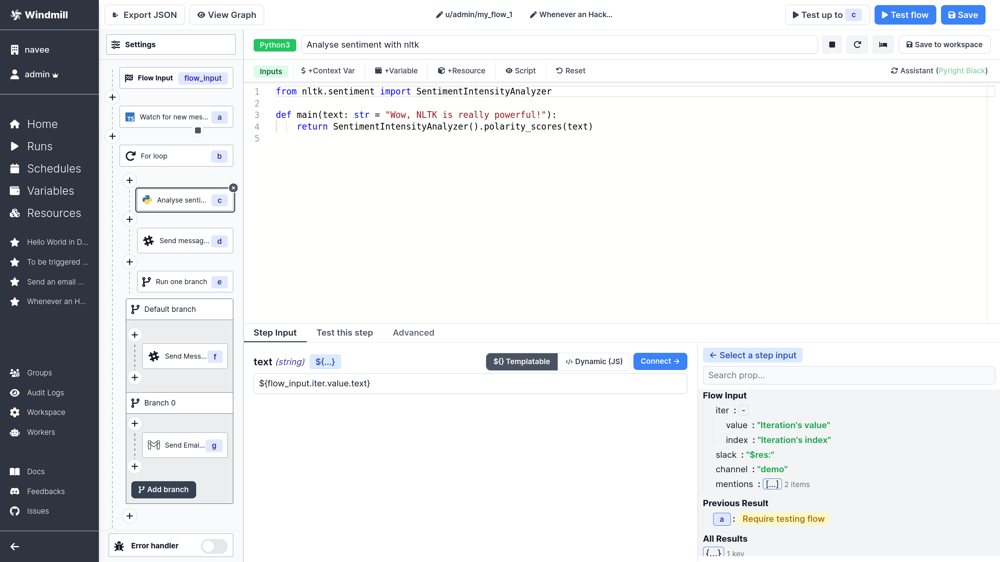
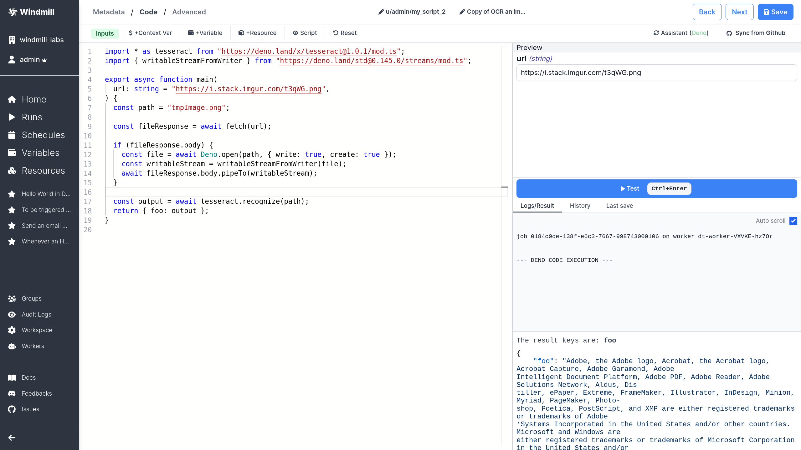
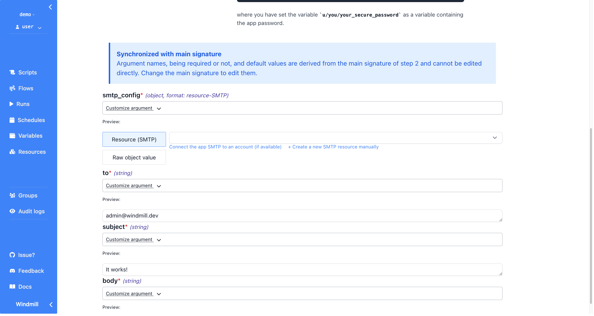

<p align="center">
  <a href="https://app.windmill.dev"></a>
</p>
<p align="center">
    <em>.</em>
</p>
<p align=center>
Open-source developer infrastructure for internal tools. Self-hostable alternative to Airplane, Pipedream, Superblocks and a simplified Temporal with autogenerated UIs to trigger workflows and scripts as internal apps. Scripts are turned into UIs and no-code modules, no-code modules can be composed into very rich flows, and script and flows can be triggered from internal UIs made with a low-code builder. The script languages supported are: Python, Typescript, Go, Bash.
</p>

<p align="center">
<a href="https://github.com/windmill-labs/windmill/actions/workflows/docker-image.yml" target="_blank">
    
</a>
<a href="https://pypi.org/project/wmill" target="_blank">
    
</a>
<a href="https://discord.gg/V7PM2YHsPB" target="_blank">
  
</a>
</p>

---

**Join the beta (personal workspaces are free forever)**:
<https://app.windmill.dev>

**Documentation**: <https://docs.windmill.dev>

**Discord**: <https://discord.gg/V7PM2YHsPB>

**Hub**: <https://hub.windmill.dev>

**Contributor's guide**: <https://docs.windmill.dev/docs/contributors_guide>

**Roadmap**: <https://github.com/orgs/windmill-labs/projects/2>

**[Self-host instruction](#how-to-self-host)**

You can show your support for the project by starring this repo.

---

Windmill Labs offers commercial licenses and support to convert your existing
automation and help you scale it in production. If interested, contact
ruben@windmill.dev (founder of Windmill).

---

# Windmill

<p align="center">
<b>Disclaimer: </b>Windmill is in <b>BETA</b>. It is secure to run in production but we are still <a href="https://github.com/orgs/windmill-labs/projects/2">improving the product fast<a/>.
</p>



Windmill is <b>fully open-sourced (AGPLv3)</b>:

## What is the general idea behind Windmill

1. Define a minimal and generic script in Python, Typescript, Go or Bash that solves a
   specific task. Here sending an email with SMTP. The code can be defined in
   the provided Web IDE or synchronized with your own github repo:
   

2. Your scripts parameters are automatically parsed and generate a frontend. You
   can narrow down the types during task definition to specify regex for string,
   an enum or a specific format for objects. Each script correspond to an app by
   itself: 

3. Make it flow! You can chain your scripts or scripts made by the community
   shared on [WindmillHub](https://hub.windmill.dev). There is tight integration
   between Windmill and the hub to make it easy to build flows from a soon-to-be
   exhaustive library of generic modules. In flows, one can pipe output to input
   using rich expressions that are just plain Javascript underneath. Flows
   support for-loops, branching, approval steps. As such and coupled with
   inputs being able to refer to any step's output, they are actual DAG rather
   than just linear sequences. They are backed by an open JSON spec we call
   [OpenFlow](https://docs.windmill.dev/docs/openflow)

Both scripts and flows are not restricted to be triggered by the UI. They can be
triggered by a schedule, watch for changes (using
[internal states](https://docs.windmill.dev/docs/reference#internal-state)) or
triggered through API with either an async or sync webhook. The latter kind of
endpoints make Windmill akin to a self-hostable AWS Lambda. Windmill can be the
central place to host, build and run all of your integrations, automation and
internal apps. We include credentials management and OAuth integration, groups
and much more!

## CLI

We have a powerful CLI to interact with the windmill platform and sync your
scripts from your own github repo. See
[more details](https://github.com/windmill-labs/windmill/tree/main/cli)

## Layout

- `backend/`: Rust backend
- `frontend`: Svelte frontend
- `lsp/`: Lsp asssistant for the monaco editor
- `<lang>-client/`: Windmill client for the given `<lang>`

## Stack

- Postgres as the database
- backend in Rust with the following highly-available and horizontally scalable
  architecture:
  - stateless API backend
  - workers that pull jobs from a queue in Postgres (and later, Kafka or Redis.
    Upvote [#173](#https://github.com/windmill-labs/windmill/issues/173) if
    interested )
- frontend in Svelte
- scripts executions are sandboxed using google's
  [nsjail](https://github.com/google/nsjail)
- javascript runtime is the
  [deno_core rust library](https://denolib.gitbook.io/guide/) (which itself uses
  the [rusty_v8](https://github.com/denoland/rusty_v8) and hence V8 underneath)
- typescript runtime is deno
- python runtime is python3
- golang runtime is 1.19.1

## Security

### Sandboxing and workload isolation

Windmill uses [nsjail](https://github.com/google/nsjail) on top of the deno
sandboxing. It is production multi-tenant grade secure. Do not take our word for
it, take [fly.io's one](https://fly.io/blog/sandboxing-and-workload-isolation/)

### Secrets, credentials and sensitive values

There is one encryption key per workspace to encrypt the credentials and secrets
stored in Windmill's K/V store.

In addition, we strongly recommend that you encrypt the whole Postgres database.
That is what we do at <https://app.windmill.dev>.

## Performance

The performances are great, as long as you do not exceed the parallelism of the
workers, we are
[worse than AWS Lambda for small workloads but not by that much](https://docs.windmill.dev/docs/benchmark)

## Architecture

<p align="center">

### Big-picture Architecture


### Technical Architecture


</p>

## How to self-host

We only provide docker-compose setup here. For more advanced setups, like
compiling from source or using without a postgres super user, see
[documentation](https://docs.windmill.dev/docs/how-tos/self_host)

### Docker compose

`docker compose up` with the following docker-compose is sufficient:
<https://github.com/windmill-labs/windmill/blob/main/docker-compose.yml>

Go to https://localhost et voilà :)

For older kernels < 4.18, set `DISABLE_NUSER=true` as env variable, otherwise
nsjail will not be able to launch the isolated scripts.

To disable nsjail altogether, set `DISABLE_NSJAIL=true`.

The default super-admin user is: admin@windmill.dev / changeme

From there, you can create other users (do not forget to change the password!)

### Commercial license

To self-host Windmill, you must respect the terms of the AGPLv3 license which
you do not need to worry about for personal uses. For business uses, you should
be fine if you do not re-expose it in any way Windmill to your users and are
comfortable with AGPLv3.

To re-expose any Windmill parts to your users as a feature of your product, or
to build a feature on top of Windmill, to comply with AGPLv3 your product must
be AGPLv3 or you must get a commercial license. Contact us at
<license@windmill.dev> if you have any doubts.

In addition, a commercial license grants you a dedicated engineer to transition
your current infrastructure to Windmill, support with tight SLA, audit logs
export features, SSO, unlimited users creation, advanced permission managing features
such as groups and the ability to create more than one workspace.

### OAuth for self-hosting (very optional)

To get the same oauth integrations as Windmill Cloud, mount `oauth.json` with
the following format:

```json
{
  "<client>": {
    "id": "<CLIENT_ID>",
    "secret": "<CLIENT_SECRET>",
    "allowed_domains": ["windmill.dev"] //restrict a client OAuth login to some domains
  }
}
```

and mount it at `/usr/src/app/oauth.json`.

[The list of all possible "connect an app" oauth clients](https://github.com/windmill-labs/windmill/blob/main/backend/oauth_connect.json)

To add more "connect an app" OAuth clients to the Windmill project, read the
[Contributor's guide](https://docs.windmill.dev/docs/contributors_guide). We
welcome contributions!

You may also add your own custom OAuth2 IdP and OAuth2 Resource provider:

```json
{
  "<client>": {
    "id": "<CLIENT_ID>",
    "secret": "<CLIENT_SECRET>",
    // To add a new OAuth2 IdP
    "login_config": {
      "auth_url": "<auth_endpoint>",
      "token_url": "<token_endpoint>",
      "userinfo_url": "<userinfo endpoint>",
      "scopes": ["scope1", "scope2"],
      "extra_params": "<if_needed>"
    },
    // To add a new OAuth2 Resource
    "connect_config": {
      "auth_url": "<auth_endpoint>",
      "token_url": "<token_endpoint>",
      "scopes": ["scope1", "scope2"],
      "extra_params": "<if_needed>"
    }
  }
}
```


### Resource types

You will also want to import all the approved resource types from
[WindmillHub](https://hub.windmill.dev). There is no automatic way to do this
automatically currently, but it will be possible using a command with the
upcoming CLI tool.

## Run a local dev setup

### only Frontend

This will use the backend of <https://app.windmill.dev> but your own frontend
with hot-code reloading.

1. Install [caddy](https://caddyserver.com)
2. Go to `frontend/`:
   1. `npm install`, `npm run generate-backend-client` then `npm run dev`
   2. In another shell `sudo caddy run --config CaddyfileRemote`
3. Et voilà, windmill should be available at `http://localhost/`

### Backend + Frontend

See the [./frontend/README_DEV.md](./frontend/README_DEV.md) file for all
running options.

1. Create a Postgres Database for Windmill and create an admin role inside your
   Postgres setup.
   The easiest way to get a working postgres is running `cargo install sqlx-cli && sqlx migrate run`.
   This will also avoid compile time issue with sqlx's `query!` macro
2. Install [nsjail](https://github.com/google/nsjail) and have it accessible in
   your PATH
3. Install deno and python3, have the bins at `/usr/bin/deno` and
   `/usr/local/bin/python3`
4. Install [caddy](https://caddyserver.com)
5. Install the [lld linker](https://lld.llvm.org/)
6. Go to `frontend/`:
   1. `npm install`, `npm run generate-backend-client` then `npm run dev`
   2. In another shell `npm run build` otherwise the backend will not find the `frontend/build` folder and will crash
   3. In another shell `sudo caddy run --config Caddyfile`
7. Go to `backend/`:
   `DATABASE_URL=<DATABASE_URL_TO_YOUR_WINDMILL_DB> RUST_LOG=info cargo run`
8. Et voilà, windmill should be available at `http://localhost/`

## Contributors

<a href="https://github.com/windmill-labs/windmill/graphs/contributors">
  
</a>

## Copyright

Windmill Labs, Inc 2022
