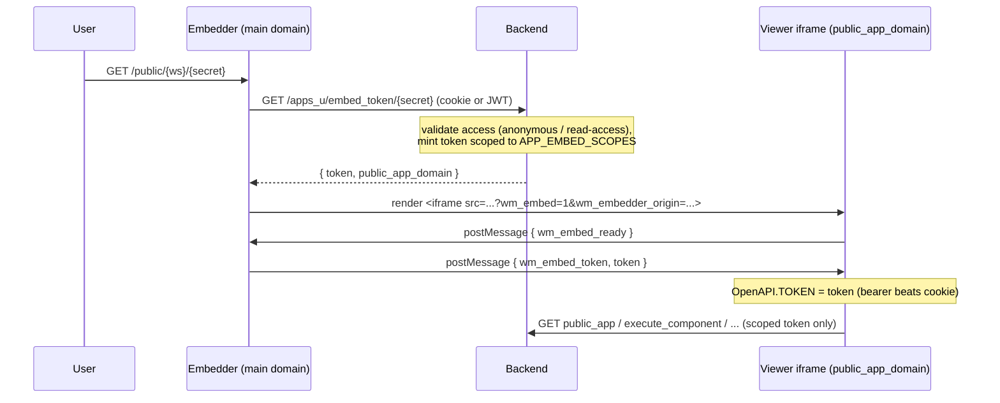

# App iframe isolation & scoped embed tokens (WIN-2006)

Published Windmill apps (and raw apps) render arbitrary, user-authored markup
and JavaScript. If that document runs on the same origin as the main Windmill
UI, an XSS payload in an app can read the httponly session cookie's privileges
(via same-origin `fetch`) and act as the logged-in user across the whole API.

To contain this, **apps are always rendered inside an iframe**, and the iframe
is handed a **narrowly-scoped token** by its embedder at startup — never the
main session cookie. When a dedicated public app domain is configured, the
iframe also lives on a **separate origin**, which turns the containment into a
hard browser-enforced boundary.

## Roles

The same public-app route plays two roles, selected by the `wm_embed=1` query
param plus whether the window is framed:

- **Embedder** (top-level window, main domain): authenticates the viewer using
  the main-domain session cookie or a shared JWT, mints a scoped embed token,
  and renders an `<iframe>` pointing at the same route on the iframe origin. It
  hands the token to the iframe via `postMessage`. Login (for non-anonymous
  apps) happens here, so the session cookie is only ever set on the main domain.
- **Viewer** (framed window, iframe origin): receives the token from the
  embedder, uses it as the *only* credential for API calls, and renders the app.

## Scoped embed token

`APP_EMBED_SCOPES` (in `backend/windmill-api/src/apps.rs`) is the token-level
replacement for the host-based `PUBLIC_APP_DOMAIN` route whitelist. Instead of
restricting which routes a *domain* may hit, it restricts which routes the
*token* may hit:

| Scope | Grants | App needs it for |
|-------|--------|------------------|
| `apps:run` | read + run on the `apps` domain (NOT write) | `public_app`, `get_data`, `public_resource`, `execute_component` |
| `jobs:read` | read jobs | `getupdate_sse`, completed-job results |
| `resources:read` | read resources | `resources/list`, `resources/type/*` |
| `users:read` | read users | `users/whoami` |
| `folders:read` | read folders | `folders/listnames` |

Because the token lacks `apps:write`, `scripts:*`, `variables:*`, `settings:*`
etc., an XSS-compromised app cannot reach app-management or any other workspace
endpoint — verified in `apps.rs` tests and manually (out-of-scope routes return
`403`). The token is minted short-lived (12h) and re-minted on demand when the
viewer reports a `401`.

For **anonymous** apps no token is minted: the iframe calls the already-public
`apps_u/*` endpoints anonymously.

## Same-origin vs. separate-origin

- **`PUBLIC_APP_DOMAIN` set** → the iframe `src` is on that domain. The app
  document is cross-origin to the main UI: it cannot read the main session
  cookie at all, and the scoped token is its only credential. This is the full
  XSS boundary.
- **`PUBLIC_APP_DOMAIN` unset** → the iframe is same-origin. The scoped token
  still constrains the app's own API calls, but a raw XSS payload could still
  issue same-origin cookie-authenticated requests. This residual risk is
  inherent to single-domain deployments (documented in WIN-2006); configuring a
  public app domain removes it.

## Status / follow-ups

Implemented in this change:
- Backend `embed_token` endpoints (by secret in OSS `apps.rs`, by custom path in
  EE `apps_ee.rs`) + `APP_EMBED_SCOPES`.
- `PublicAppFrame.svelte` embedder/viewer orchestration with the postMessage
  handshake, wired into both public-app routes (`/public/{ws}/{secret}` and
  `/a/{custom_path}`).

Known follow-ups:
- `Content-Security-Policy: frame-ancestors` on the viewer so only the embedder
  origin can frame it (currently enforced in JS by requiring the framed state +
  validated embedder origin).
- Retiring the `public_app_domain` route whitelist (`public_app_layer.rs`) once
  the scoped-token path is the sole mechanism in all deployments.
- S3 upload/delete from *authenticated* embedded apps (needs `apps:write`, which
  is intentionally withheld) — anonymous apps are unaffected.
- Cross-origin (`PUBLIC_APP_DOMAIN`) validation requires a second domain in the
  environment; only the same-origin path has been exercised end-to-end here.
- Raw-app cross-origin-isolation (`COEP`) behaviour inside the viewer iframe.
