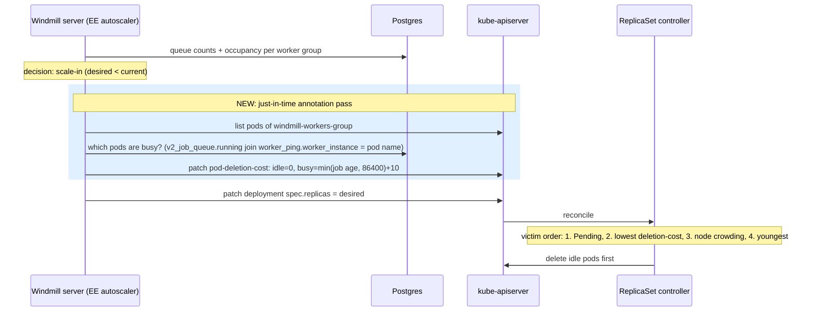

# Investigation: leveraging `pod-deletion-cost` for Kubernetes autoscaling (WIN-2028)

**Verdict: yes — it can and should be leveraged.** The
[`controller.kubernetes.io/pod-deletion-cost`](https://kubernetes.io/docs/concepts/workloads/controllers/replicaset/#pod-deletion-cost)
annotation is the supported Kubernetes mechanism for steering *which* pods a
ReplicaSet kills on scale-in, and it fixes a real gap in Windmill's native
Kubernetes autoscaling integration: today the autoscaler only sets the replica
*count* and Kubernetes may pick a busy worker as the victim while idle workers
survive. The recommended approach is a **centralized, just-in-time annotation
pass** performed by the server right before it patches replicas down (Option B
below) — it requires no worker-side changes, fits the existing EE
`windmill-autoscaling` crate, and stays well within the update-frequency
guidance from the Kubernetes docs.

## Background: how the autoscaling integration works today

The EE autoscaler (`windmill-autoscaling/src/autoscaling_ee.rs`, EE repo) runs
every 30s on the server. Per worker group it compares queue counts and
occupancy rates against the configured thresholds and emits scale-in/scale-out
events with a **desired worker count**. With the `Kubernetes` integration,
`apply_kubernetes_autoscaling` (`kubernetes_integration_ee.rs`) patches
`spec.replicas` on the Deployment `windmill-workers-<worker_group>` in the
server's own namespace, using an in-cluster `kube` client. RBAC (helm chart
`rbac.yaml`, gated by `enterprise.createKubernetesAutoscalingRolesAndBindings`)
grants the `windmill` service account `get`/`patch` on `deployments` only.

That is the full extent of the integration's control: **the replica count**.
When the count decreases, the ReplicaSet controller — not Windmill — chooses
which pods to delete, using this documented priority order:

1. Pending (and unschedulable) pods first
2. **Lower `controller.kubernetes.io/pod-deletion-cost` first** (if set)
3. Pods on nodes with more replicas of the ReplicaSet first
4. Younger pods first (logarithmically bucketed creation timestamps)

Since all Windmill worker pods are typically Running and Ready, today's
effective tiebreakers are (3) node crowding and (4) pod age — both blind to
whether a worker is mid-job.

## The failure mode this causes

Workers handle SIGTERM gracefully: the killpill stops them from pulling new
jobs, the in-flight job runs to completion, and only then does the process
exit (with a hard 7-day cap, mirrored by the helm chart's
`terminationGracePeriodSeconds` default of 604800). So a scale-in never
*corrupts* a job — but when Kubernetes picks a busy pod:

- The busy pod sits in `Terminating` for as long as its job runs (up to
  days for long batch jobs), holding its node resources the whole time.
- The idle pods the scale-in was meant to shed **stay alive**, so the cluster
  sheds no real capacity until the long job finishes.
- If the grace period or the operator's patience runs out (manual delete,
  node drain pressure, spot reclaim escalation), the job dies and is
  recovered only by the zombie-job monitor (`backend/src/monitor.rs`,
  `ZOMBIE_JOB_TIMEOUT`) which restarts it from scratch.
- Flows pinned to a worker (`same_worker`) and dedicated workers lose their
  affinity target.

In short: scale-in is *safe* today but frequently *ineffective*, and the
blast radius lands on exactly the pods that should be protected.

## What `pod-deletion-cost` provides

- **Annotation**: `controller.kubernetes.io/pod-deletion-cost`, string
  representation of an int32 (`[-2147483647, 2147483647]`); unset/invalid ⇒ 0.
  Lower cost ⇒ deleted first.
- **Status**: beta since Kubernetes **1.22**, feature gate `PodDeletionCost`
  **enabled by default** (still beta as of 1.34 — no GA yet, but it has been
  on-by-default for every version Windmill realistically targets; managed
  offerings EKS/GKE/AKS all have it active).
- **Semantics**: best-effort hint to the ReplicaSet controller; honored at
  downscale-evaluation time, ranked above node-crowding and age (see order
  above). It applies to Deployments/ReplicaSets only — **not** StatefulSets
  (which scale down by ordinal) and not to node drains, evictions, or
  preemption.
- **Documented caveat**: avoid *frequent* updates to the annotation (e.g.
  tying it to a continuously-changing metric) because each update is an
  apiserver pod-object write.

The Kubernetes docs' own example use case is precisely ours: "different pods
of an application could have different utilization levels. On scale down, the
application may prefer to remove the pods with lower utilization."

## Why the server already knows everything it needs

- `v2_job_queue` rows with `running = true` carry the executing `worker` name
  and `started_at` — the authoritative "who is busy" signal.
- `worker_ping.worker_instance` is the worker's **hostname**, which in
  Kubernetes **is the pod name** (`insert_ping(hostname, …)` at worker
  startup). This gives a direct worker → pod mapping with no new plumbing.
- Native-mode pods run 8 worker processes (`NUM_WORKERS=8`), so multiple
  `worker_ping` rows must be grouped by `worker_instance` to get per-pod
  busy-ness. Note the existing pod-counting query in `autoscaling_ee.rs`
  deliberately avoids `worker_instance` because custom worker groups can
  share a hostname across multiple worker processes — that collapses a
  *count*, but it is harmless here: grouping by `worker_instance` for
  busy-ness just means "any worker on this host is busy", which is exactly
  the per-pod signal wanted (on Kubernetes, one hostname = one pod).

## Design options considered

### Option A — workers self-annotate their pods (decentralized)

Each worker pod patches its own deletion-cost on busy↔idle transitions
(pod name via the Downward API, in-cluster client).

Rejected as the primary mechanism:

- **Write amplification**: Windmill workers routinely chew through many short
  jobs per second; annotating on every transition is exactly the
  "update based on a metric value" pattern the Kubernetes docs warn against.
  Debouncing/thresholding ("only annotate for jobs running > Xs") mitigates
  but adds state to the hot job loop.
- Pulls `kube`/`k8s-openapi` into `windmill-worker` (today these deps live
  only in the server-side autoscaling crate) and requires `patch pods` RBAC
  on **every worker pod's** service account. RBAC cannot express
  "patch only your own pod", so any compromised job sandbox escape could
  re-cost other pods (mitigable with a ValidatingAdmissionPolicy, but that's
  more machinery to ship and support).

### Option B — server annotates just-in-time before scale-in (recommended)

Extend `apply_kubernetes_autoscaling` so that when `desired < current` it
performs an annotation pass *before* patching `spec.replicas`:

1. List the deployment's pods (label selector on `windmill-workers-<group>`).
2. One SQL query: per pod (`worker_ping.worker_instance`), is any of its
   workers running a job (`v2_job_queue.running = true` joined on worker
   name), and how long has the oldest such job been running.
3. Patch `controller.kubernetes.io/pod-deletion-cost` on each pod whose
   correct value differs from its current one: idle pods ⇒ `0` (or remove),
   busy pods ⇒ positive cost, e.g.
   `min(elapsed_seconds_of_oldest_running_job, 86_400) + 10` so the
   longest-running work is protected hardest. Dedicated-worker pods can get a
   large constant bump on top.
4. Patch replicas as today.

Properties:

- **Bounded, rare writes**: annotations are only touched on actual scale-in
  events, which are already cooldown-gated (default ≥ 5 min apart per group),
  and only for pods whose value changed. This is squarely within the
  documented usage guidance.
- **No worker changes, no new crates**: the kube client, error taxonomy, and
  healthcheck all live in `kubernetes_integration_ee.rs` already.
- **Single RBAC addition**: `pods: get/list/patch` on the existing
  autoscaler role in the helm chart (same
  `createKubernetesAutoscalingRolesAndBindings` gate), plus an updated
  `healthcheck()` SSAR probe so misconfiguration degrades loudly. Missing pod
  permissions should log a warning and fall through to the replica patch —
  deletion-cost is an optimization, never a correctness requirement.
- **Staleness is a non-issue**: costs are recomputed immediately before every
  downscale, and the ReplicaSet controller reads them at victim-selection
  time. Annotations left behind between scale-ins have no effect on anything
  else.

Known race: a worker can pick up a job in the window between the annotation
pass and the ReplicaSet controller's victim selection (sub-second to a few
seconds). The annotation is best-effort anyway; the existing SIGTERM
finish-current-job behavior remains the correctness backstop. This is
strictly better than today, where victim selection is *always* blind.

### Option C — delete chosen pods directly instead of costs

"Scale down by deleting specific pods" has no atomic API: deleting a pod
without lowering `replicas` gets it recreated, and lowering `replicas` first
races the ReplicaSet controller's own victim choice. KEP-2255 (which produced
`pod-deletion-cost`) exists precisely because this approach is unsound.
Rejected.

### Option D — HPA/KEDA users

Users who scale Windmill workers with HPA or KEDA instead of the native
integration have the same victim-selection problem, and those tools also
defer to the ReplicaSet controller (KEDA's docs point at `pod-deletion-cost`
for exactly this). Option B's annotation pass only runs from Windmill's own
scale-in path, so it doesn't help them. A periodic opt-in annotator loop
(refresh costs every ~30s, write only on transitions) could be a follow-up,
but it reintroduces the update-frequency concern and is out of scope for the
first iteration.

## Limitations

- Best-effort: no guarantee the ReplicaSet controller honors the hint (e.g.
  Pending pods still rank above it, and the gate could theoretically be
  disabled on self-managed clusters < 1.22 or with the gate turned off).
- Deployments only. The helm chart's optional StatefulSet controller kind
  scales down by highest ordinal regardless of cost; the annotation pass
  should be skipped/no-op there.
- Does not protect against node drains, spot reclaims, evictions, or manual
  deletes — only ReplicaSet downscale decisions (i.e. Windmill autoscaling
  scale-ins, which is the point).
- One apiserver list + up to N patches per scale-in event; negligible at the
  fleet sizes involved (max_workers is a u16 and typical groups are ≪ 1000
  pods).

## Recommended follow-up scope (implementation ticket)

1. EE repo, `windmill-autoscaling/src/kubernetes_integration_ee.rs`:
   `annotate_pod_deletion_costs(worker_group, db)` called from
   `apply_kubernetes_autoscaling` when shrinking; busy-pod query as described
   above; tolerate and log RBAC failures without aborting the scale.
2. EE repo, `healthcheck()`: add SSAR probes for `pods` `list`/`patch`
   (warning-level, not fatal, to keep existing installs green).
3. windmill-helm-charts: add `pods: get/list/patch` to the autoscaler role
   behind the existing flag; document the StatefulSet caveat next to
   `controller` kind validation.
4. Docs: note the behavior change ("scale-in prefers idle workers") and the
   best-effort caveat in the autoscaling docs.
