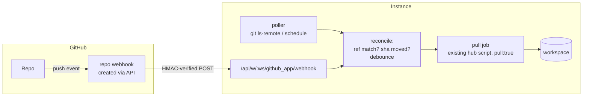

# Design: Automatic git → Windmill sync (pull-based)

Status: draft for review — exploration on branch `explore-git-sync-improvements`

## 1. Problem

Git sync is guided and automatic in one direction only. Windmill → repo is fully
managed: every deploy enqueues a `deploymentcallback` job that runs the hub sync
script and commits to the repo. The reverse direction (repo → Windmill) requires
each customer to install a GitHub Action that runs `wmill sync push` with a
long-lived Windmill token stored as a repo secret, against an instance URL that
GitHub-hosted runners must be able to reach.

This breaks down because each customer runs their own instance:

| Customer setup                      | GH runner → instance | GitHub webhook → instance | Instance → GitHub |
| ----------------------------------- | -------------------- | ------------------------- | ----------------- |
| Windmill cloud                      | ✅                   | ✅                        | ✅                |
| Self-hosted, public URL             | ✅                   | ✅                        | ✅                |
| Self-hosted behind VPN/firewall     | ❌                   | ❌                        | ✅                |
| GHES on the same private network    | ❌ (github.com runners) | ✅                     | ✅                |

Only instance → GitHub outbound works for everyone. The current GH Action design
sits in the worst column; it also requires manual workflow-file installation,
token provisioning, and ongoing maintenance per customer.

## 2. Current state (what already exists)

The building blocks are mostly shipped:

- **Instance-side pull already works.** `PullWorkspaceModal.svelte` runs the hub
  init script (`hubPaths.gitInitRepo`) with `pull: true`, `dry_run` preview, and
  `use_promotion_overrides` as a worker job. It clones the repo with the repo
  credentials and applies the diff to the workspace. It is manual-only today.
- **Managed GitHub App.** `windmill-sync-helper` (github.com / *.ghe.com) is
  installed by the customer; installation tokens are minted by the customer
  portal (`windmill-customer-service`, route `/github_sync/token`) against a JWT
  the instance stores per installation (`workspace_settings.git_app_installations`,
  token logic in `backend/windmill-common/src/git_sync_ee.rs`). The portal is
  stateless: it keeps no installation registry and receives no webhooks.
- **Self-managed app for GHES.** Customers create their own GitHub App; app id +
  private key live in instance settings (`GhesAppSettings.svelte`,
  `get_self_managed_installation_token`). The current setup checklist tells the
  customer to leave the app webhook **inactive**.
- **Webhook machinery.** The native GitHub trigger already creates/deletes repo
  webhooks via the REST API (`windmill-native-triggers/src/github/external.rs`)
  and GitHub HMAC (`X-Hub-Signature-256`) verification exists in
  `windmill-trigger-http/src/http_trigger_auth.rs`.
- **Loop prevention convention.** Windmill-authored commits carry a `[WM]`
  prefix so CI can ignore them.
- **Promotion plumbing.** The CLI implements `--promotion <branch>` resolving
  `promotionOverrides` from `wmill.yaml`; the pull job already accepts
  `use_promotion_overrides`. PR creation on `wm_deploy/**` branches is done by a
  documented GH Action (`gh pr create`), not by Windmill.

What is missing is only the **trigger** (push event → pull job), the **routing**
(event ref → workspace), and **PR creation** moving instance-side for
promotion/fork parity.

## 3. Goals / non-goals

Goals:

- Zero-CI automatic repo → Windmill deployment: install app, pick repo, done.
- Works for every connectivity profile, degrading gracefully from instant
  (webhook) to near-real-time (polling).
- Cover all documented setups: basic sync, multi-repo, promotion mode
  (single- and cross-instance), workspace forks, local-dev git entry.
- No new credentials handed to GitHub (no Windmill tokens as repo secrets).
- Coexist with customer CI: customers who keep the GH Action lose nothing.

Non-goals (this design):

- Replacing customer CI pipelines (tests, lint, custom gates).
- A central event-relay through the portal (delivering the managed app's
  webhook centrally and forwarding to instances). Considered and rejected for
  v1 in favor of programmatic repo webhooks; the portal stays a stateless token
  minter. See §16 for the comparison.
- GitLab/Bitbucket/Azure DevOps parity. The polling tier covers them
  credential-wise; their webhook tiers are follow-ups.

## 4. Design overview



One principle drives the security model: **webhooks and polls are hints, the
pull is authoritative.** A trigger never carries content; it only causes the
instance to compare the remote HEAD against `last_synced_sha` using its own
credentials and enqueue the existing pull job if the branch moved. A forged or
replayed trigger can only cause a cheap no-op reconcile.

## 5. Trigger tier 1 — webhooks

### 5.1 Managed app (github.com, GHE Cloud orgs)

A GitHub App's own webhook URL is fixed app-wide (it points at the portal), so
per-instance delivery uses **repository webhooks** created dynamically with the
installation token (`POST /repos/{owner}/{repo}/hooks`). Requires adding the
**Repository webhooks: read & write** permission to `windmill-sync-helper`
(see §9).

Flow when a repo is connected (or auto-pull is enabled on an existing repo):

1. Instance generates a per-repo secret, stored in the repo's git-sync settings.
2. Instance creates the webhook via API: events `["push"]` (later
   `"pull_request"`, §11), URL
   `{base_url}/api/w/{workspace}/github_app/webhook` (host-aware, so managed and
   self-managed/GHES apps use the same per-workspace receiver), secret set.
3. GitHub immediately delivers a `ping` event. If the ping is not received
   within ~10 s, the instance deletes the hook and falls back to polling,
   surfacing "instance not reachable from GitHub — using polling (interval Xm)"
   in the UI. This doubles as an automatic reachability test; no guessing about
   firewalls.
4. Incoming deliveries are verified with `X-Hub-Signature-256` against the
   stored secret (reuse the HMAC code from `http_trigger_auth.rs`), then handed
   to the reconciler (§7).

Webhook lifecycle: deleted when the repo is disconnected or auto-pull disabled
(reuse the delete pattern from `workspace_integrations.rs`); recreated on
settings change; orphan hooks are detectable via `GET /repos/.../hooks` filtered
by our URL prefix.

### 5.2 Self-managed app (GHES, *.ghe.com data residency)

The customer owns the app, so the **app-level webhook** can point directly at
the instance — no repo hooks needed, one webhook covers all installed repos:

- `GhesAppSettings` gains a "Webhook secret" field; the setup checklist changes
  from "Uncheck Active under Webhook" to "set webhook URL to
  `{base_url}/api/w/{workspace}/github_app/webhook` (the per-workspace receiver),
  subscribe to Push events, paste this generated secret".
- That per-workspace endpoint verifies HMAC with the configured secret and
  routes by repo full name + installation to matching workspaces (the routing
  data is in `workspace_settings`).
- GHES typically shares a network with the instance, so this works **air-gapped**
  — the hardest github.com case is the easiest GHES case.

Polish (optional, recommended): replace the 8-step manual app-creation checklist
with the [GitHub App Manifest flow](https://docs.github.com/en/apps/sharing-github-apps/registering-a-github-app-from-a-manifest)
(supported on GHES), which pre-configures permissions, events, and webhook
URL/secret in one click and eliminates checklist drift.

## 6. Trigger tier 2 — polling fallback

For private instances, plain token/SSH credentials (no app), and
permission-not-yet-approved installs:

- Per auto-pull-enabled repo, on a configurable interval (default 60 s,
  surfaced in settings), run `git ls-remote <repo> <tracked refs>` and compare
  against `last_synced_sha` per ref. `ls-remote` is a single cheap round-trip;
  no clone.
- Implemented as an internal scheduled task keyed by repo settings id (not a
  user-visible schedule), running on workers like other background jobs.
- Polling is also the safety net under webhooks (missed deliveries, GitHub
  outages): when a webhook is active, the poll interval relaxes (e.g. 10 min)
  rather than turning off. This is the ArgoCD model: poll for correctness,
  webhook for latency.

## 7. Reconcile and pull semantics

Routing — an event/poll result is `(repo, ref, head_sha, sender)`:

- **Tracked branch** (basic sync): ref equals the repo settings branch →
  pull into the owning workspace.
- **Promotion target branch**: ref equals a repo's promotion target → pull with
  `use_promotion_overrides: true` (resolves `promotionOverrides` from
  `wmill.yaml`, mirroring CLI `--promotion`).
- **Fork branches** `wm-fork/<parent-branch>/<fork-name>`: parse the branch
  name, route to the fork workspace if it exists; ignore (log) if not.
- **Anything else**: ignore.
- Matching keys on repo + `workspace_id` — never `base_url` (avoids the known
  internal-vs-public URL mismatch that breaks CLI workspace matching).
- One repo may match several workspaces (team partitioning with different path
  filters): fan out, each workspace pulls with its own filters; `wmill.yaml` in
  the repo stays authoritative for include/exclude.

Loop prevention (pull → deploys → deployment callback → commit → push event):

1. Skip events whose sender is the app bot (`windmill-sync-helper[bot]` /
   the GHES app's bot) or whose head commit message carries the `[WM]` prefix.
2. Compare `head_sha` to `last_synced_sha` before enqueuing; the pull job
   records the synced sha on success.
3. Deploys applied by the pull job are tagged so the deployment callback can
   skip the no-op commit (belt and braces — the diff should be empty anyway).

Concurrency and debounce:

- At most one pull job per (repo, workspace) at a time; rapid pushes coalesce
  (same pattern as the 5 s deploy-callback batching, keyed on repo).
- Pulls and in-flight Windmill → repo commits on the same branch serialize on
  the same key to avoid races.

Execution: reuse the existing pull path of the hub init script for v1. Two known
fragilities to fix as part of making this an unattended automation:

- The hub script pins a `windmill-cli` version; pin lag has caused 422s against
  newer backends. The automated path must pin the CLI to the instance's own
  version (or the pull logic moves into the backend natively as a v2).
- Failures must be visible: pull jobs appear in the runs list like deployment
  callbacks today (`/runs?job_kinds=deploymentcallbacks` equivalent), plus a
  per-repo "last sync" status chip in git-sync settings and the workspace error
  handler firing on repeated failures.

## 8. Settings and schema

Per-repo (`GitRepositorySettings`, `workspace_settings.git_sync`):

```text
auto_pull:           Option<AutoPullSettings>
  enabled:           bool
  mode:              "webhook" | "polling" | "auto"   (auto = try webhook, fall back)
  poll_interval_s:   Option<u32>                       (default 60; 600 when webhook active)
  webhook_id:        Option<i64>                       (GitHub hook id, managed app)
  webhook_secret:    Option<String>                    (encrypted; per-repo, managed app)
  last_synced_sha:   Option<map<ref, sha>>             (per tracked ref)
  last_pull_status:  Option<...>                       (sha, time, job id, error)
```

Instance-level (GHES app config): `webhook_secret` alongside app id/private key.

No new tables; everything extends existing JSONB settings. A migration is only
needed if we decide `last_synced_sha`/status churn doesn't belong in
`workspace_settings` (alternative: small `git_sync_pull_state` table keyed by
workspace + repo path — decide at implementation review).

New instance endpoints (EE):

- `POST /api/w/{workspace}/github_app/webhook` — per-workspace hook receiver for
  managed and self-managed apps (host-aware), HMAC-verified, returns 202.
- Both are unauthenticated-but-verified endpoints; rate-limited; bodies are
  treated as hints only (§4).

## 9. GitHub App permission migration

New permissions needed, bundled into **one** update (each update re-prompts
every existing installation's org admin):

| Permission                  | Used for                                  | Phase |
| --------------------------- | ----------------------------------------- | ----- |
| Repository webhooks: write  | dynamic repo hook create/delete           | 1     |
| Pull requests: write        | instance-side PR creation (promotion/forks) | 2   |
| Checks: write               | PR diff preview checks                    | 3     |

App-only features and their fallbacks: instant webhook sync (falls back to
polling), in-app PR creation for deploy branches (fall back to the
`open-pr-on-commit` / `open-pr-on-fork-commit` workflows; the toggles are
hidden for token repos and a set-but-inert toggle logs a warning), and the PR
diff comment/check + deploy status check (no fallback: they need the Checks
API and `pull_request` webhook deliveries). Token/PAT repositories keep the
full pull direction via polling.

Rollout behavior: until an org approves, webhook creation fails with a
distinguishable error → the instance shows "approval pending" and stays on
polling. Nothing breaks; latency is the only cost. The self-managed (GHES)
checklist/manifest gains the same permissions — no central approval involved.

## 10. Setup UX

The git-sync wizard (`DetectionFlow` / repo card) gains a third guided
direction after the existing "test connection" and "initialize repo" steps:

- Toggle: **"Automatically deploy changes from Git"** (per repo).
- On enable: try webhook (ping self-test) → show resulting mode and latency
  ("instant via webhook" / "polling every 60s — instance not reachable from
  GitHub"), with a re-test button.
- The success modal's current "set up GitHub Actions" doc link becomes the
  advanced/CI path, not the default instruction.
- Promotion-mode repos additionally show "PRs will be opened by Windmill"
  once §11 lands.

## 11. Promotion & forks parity: PR creation moves instance-side

Both PR-producing branches are pushed by Windmill's own deploys — `wm_deploy/**`
(promotion) and `wm-fork/**` (fork deploys) — so opening the PR moves into the
**deploy pipeline** itself, per repo toggle: the push job carries a
`__git_sync_open_pr` marker and its completion hook opens (or reopens) the PR
via the installation token once the push has landed. Outbound-only, so it works
for every connectivity profile — no webhook required.

- Promotion: `promotion_open_prs` on the promotion repo ("Open a pull request
  for each deploy branch").
- Forks: `fork_open_prs` on the **parent's** sync repo ("Open a pull request
  when a fork deploys"), read by the fork's deploy callback — parent-owned like
  `sync_forks`, zero fork-side setup.

Both default on for newly configured repos and off in storage (upgrades don't
change behavior). `ensure_pull_request` treats an existing PR as success, so the
documented `open-pr-on-commit` / `open-pr-on-fork-commit` Actions can stay
installed for custom titles/CI without duplicate PRs. The merge side is already
covered by §7 routing (push event on the target branch).

## 12. Later: PR diff preview checks

With `pull_request` events (webhook tier) and `checks: write`: on PR
opened/synchronized, run the existing `dry_run: true` pull and post the diff
summary as a check run. This replicates the CI dry-run preview with zero
customer CI and completes the "Cloudflare Pages" experience: install app →
merges deploy, PRs show a Windmill diff. The commit-level "Deploying… →
Deployed" status (the other half of the Cloudflare feel) is Phase 6.

## 13. Coverage vs documented setups

| Documented setup                         | Covered by                                            |
| ---------------------------------------- | ----------------------------------------------------- |
| Basic git sync (workspace ↔ branch)      | §5/§6 trigger + existing pull job                     |
| Multi-repo primary/secondary             | per-repo toggle; secondaries stay push-only           |
| Promotion mode, single instance          | §7 promotion routing + §11 PR creation                |
| Promotion mode, cross-instance           | each instance triggers independently — strictly better than CI (no cross-instance tokens/URLs) |
| Workspace forks (`wm-fork/**`)           | §7 fork routing + Phase 5 (parent-level `sync_forks`) |
| PR dry-run preview                       | §12 (optional follow-up)                              |
| Local dev, git as entry point            | ordinary push events; nothing special                 |
| Customers with real CI gates             | unchanged; pull triggers are idempotent and coexist   |

## 14. Migration of existing users

The defining advantage of the repo-webhook approach: **existing git-sync users
already have the managed app installed.** Migration is "grant one incremental
permission," not "reconnect." The windmill → repo direction uses the app's
`Contents: write` grant, which the new `Repository webhooks: write` permission
does not touch — so nothing existing breaks whether or not a user migrates.

Existing installs are enumerable from `workspace_settings.git_app_installations`
(each `GitInstallation` carries `installation_id`, `account_id`, and
`github_base_url`: `None` = managed github.com app, `Some` = self-managed/GHES).
That split is the migration cohort boundary.

**Cohort A — managed app, already installed (the majority).** Only gap is the
`Repository webhooks: write` grant. GitHub keeps the old grants working while the
new permission sits pending approval, so migration is lazy and never-blocking:

1. Ship the app permission update + `auto_pull` settings defaulting **off**.
   Zero observable change until a user opts in.
2. Each managed-app repo gets an "Automatically deploy changes from Git" toggle
   in the existing settings UI.
3. On enable, the instance attempts webhook creation:
   - **403 (approval pending)** → surface a deep link to the org's app
     installation page to approve the new permission, and **start polling
     immediately** so auto-pull works right now. The user is never blocked on
     a GitHub org admin.
   - **Success** → ping self-test → webhook mode (or polling if unreachable).
4. The instance does not need to *hear* the approval. The
   `installation` / `new_permissions_accepted` event goes to the app webhook
   (the portal), not the instance — irrelevant here. The instance just retries
   webhook creation on its next poll cycle and silently upgrades polling →
   webhook once the grant lands. No portal state, no callback plumbing.

**Cohort B — no app (plain `git_repository` resource, token/SSH).** Nothing to
approve; flipping the toggle goes straight to polling with existing credentials.
Optional upsell: "install the Windmill GitHub App for instant sync."

**Cohort C — self-managed / GHES (`github_base_url: Some`).** Customer owns the
app, so there is no central approval. App-level webhooks need no extra
permission — migration is one documented step: paste the instance webhook URL +
generated secret into their app settings (the `GhesAppSettings` checklist flips
"leave webhook inactive" → "set this URL + secret"). Usually works air-gapped.

Cross-cutting:

- **Opt-in, not auto-flipped.** Do not silently enable pull on existing repos:
  some are backup/secondary push-only targets, or hold content the owner does
  not want deployed back. Surface a prominent "New: deploy automatically from
  Git" prompt instead.
- **Existing CI coexists.** A user already running `wmill sync push` via GH
  Action keeps it; sha-idempotent triggers make double-firing harmless. Optional
  cleanup: detect the workflow file via the Contents API and offer one-click
  removal once webhook pull is confirmed.
- **The unavoidable cost.** The permission bump nags *every* managed-app
  installation (even users who never enable auto-pull) with a "requesting
  updated permissions" prompt until approved or dismissed. No way around it for
  a single shared app. Mitigation is clear permission-purpose copy; the nag is
  cosmetic and does not break existing sync.
- **Capability gating precedent.** `GitRepositorySettings::is_script_meets_min_version`
  already gates behavior on the pinned hub-script version — a "this install's
  app grant supports webhooks" capability flag fits the same pattern.

## 15. Implementation plan

Staged so each phase is independently shippable and reviewable. Phase 1 alone
delivers automatic pull for every customer; webhooks are a latency upgrade.

### Phase 1 — polling + reconcile + settings + UX (no app/permission changes)

Backend (EE):

- `GitRepositorySettings` (`backend/windmill-common/src/workspaces.rs`): add
  `auto_pull: Option<AutoPullSettings>` (§8). Non-breaking JSONB addition.
- Reconcile + enqueue: new function mirroring `push_git_sync_job`
  (`windmill-git-sync/src/git_sync_ee.rs:896`) — given `(repo, ref, head_sha)`,
  resolve matching workspace(s), compare against `last_synced_sha`, and enqueue
  the pull job with the same 5 s debounce machinery. The pull job for v1 is the
  existing `gitInitRepo` hub script run with `pull: true` (mirror the payload
  `PullWorkspaceModal.svelte` already sends); record the synced sha on success.
- Poller: register a periodic task in `backend/src/monitor.rs` (alongside the
  other `tokio::time::interval` loops) that, per auto-pull-enabled repo, runs
  `git ls-remote` for the tracked refs and feeds changes into the reconciler.
- Pin the hub-script CLI to the instance version for the unattended path
  (UI git-sync runs a version-pinned `windmill-cli`; pin lag has caused 422s
  against newer backends).

Frontend:

- `GitSyncRepositoryCard.svelte`: per-repo "Automatically deploy changes from
  Git" toggle + last-sync status chip; polling interval input.
- Demote the `GitSyncSuccessModal.svelte` "set up GitHub Actions" link to an
  advanced/CI option.

Validation: pull jobs visible in the runs list; error handler fires on repeated
failure. Tests: reconcile routing + sha-compare + loop-prevention (sender/`[WM]`).

### Phase 2 — webhooks (managed app + GHES)

Ops (precedes code): update `windmill-sync-helper` to request
`Repository webhooks: write` (bundle `Pull requests: write` + `Checks: write`
now too, to avoid a second nag for phases 3–4). Update permission-purpose copy.

Backend (EE):

- Receiver endpoint (§8): `POST /api/w/{workspace}/github_app/webhook`
  (per-workspace, managed and self-managed), HMAC-verified — reuse
  `X-Hub-Signature-256` validation from
  `windmill-trigger-http/src/http_trigger_auth.rs`; routes added to
  `git_sync_ee.rs` `workspaced_service` / `global_service`.
- Webhook create/delete via installation token — reuse the REST pattern from
  `windmill-native-triggers/src/github/external.rs` and the delete pattern from
  `workspace_integrations.rs`. Ping self-test with reachability fallback (§5.1).
- Lazy approval retry + 403 detection feeding the migration UX (§14 cohort A).

Frontend:

- Toggle now reports resulting mode/latency + re-test button; approval-pending
  deep link.
- `GhesAppSettings.svelte`: webhook-secret field + updated checklist (and,
  optional, the App Manifest one-click flow, §5.2).

### Phase 3 — PR creation instance-side (promotion + forks, toggled)

- The deploy's push job carries a `__git_sync_open_pr` marker when the repo
  opted in (`promotion_open_prs` on the promotion repo; parent-level
  `fork_open_prs` for fork deploys); the job-completion hook
  (`maybe_open_git_sync_deploy_pr` in `result_processor.rs`) derives the pushed
  branch (fork branch wins, else the `wm_deploy/**` formula) and calls
  `ensure_pull_request`. Outbound with the installation token, so no webhook
  reachability is needed; app-backed repos only.
- No-op pushes skip PR creation: the push script reports `pushed: false` when
  nothing was committed (e.g. the deploy was itself caused by an auto-pull, so
  the workspace already matches the repo), and the hook returns early — a PR
  the user closed isn't recreated by the sync loop. Results without the flag
  (older script pins) keep ensuring the PR.
- Fork-branch routing edge cases (§7) hardened here.

### Phase 4 — PR diff preview checks (optional)

- Subscribe `pull_request` events; on open/synchronize run the existing
  `dry_run: true` pull and post the diff as a check run (`checks: write`).
- The same completion hook maintains ONE managed comment on the PR
  (Cloudflare deploy-preview style: workspace, status, commit, collapsible
  change list), upserted per synchronize via a hidden `<!-- windmill-diff -->`
  marker so reviewers see the current diff without opening the Checks tab.

### Phase 5 — fork sync, configured at the parent (replaces the `push-on-merge-to-forks` GitHub Action) — implemented

**Scope rule: Windmill absorbs automation for events it originates or
consumes; Actions remain for custom CI.** Of the documented CI/CD workflows:
`push-on-merge` (repo → prod workspace) is phases 1–2 auto-pull;
`push-on-merge-to-forks` (fork branch → fork workspace) is this phase; and the
PR-opening workflows (`open-pr-on-commit` for `wm_deploy/**`,
`open-pr-on-fork-commit` for `wm-fork/**`) react to branches Windmill itself
pushes, so they move into the deploy pipeline as per-repo toggles (§11 / Phase
3) and the Actions become optional alternatives. (A `fork_pull_sync` "fan the
tracked branch out to every fork" draft was dropped: a fork syncs its *own*
`wm-fork/**` branch, never `main` directly, and blind fan-out would clobber a
dev workspace's local work.)

**The premise.** `create_workspace_fork` copies the parent's resources (so the
`git_repository` resource lands in the fork) and, via `clone_workspace_data` →
`update_workspace_settings`, the parent's `git_app_installations` and `git_sync`
(keeping the first sync-mode repo — WIN-1559). So a fork already pushes to its
`wm-fork/<tracked>/<id>` branch on deploy. What it must **not** inherit is the
`auto_pull` block: it carries the parent's `webhook_id`/`webhook_secret` (the
repo webhook is parent-owned), so `update_workspace_settings` strips it. The
server also rejects parent-only settings on a fork workspace (enabled
`auto_pull`, promotion mode, `fork_open_prs`) — a fork's deploys always target
its `wm-fork/**` branch, so none of them could take effect there, and fork sync
is exclusively parent-managed.

**Design: one parent-level toggle, `auto_pull.sync_forks` (default on when
auto-pull is enabled).** Matches the Action model (configured once at the repo,
fires for every `wm-fork/**` branch) and needs zero per-fork setup — no fork
webhook, resource, or config; applies to current *and* future forks.

How a fork branch change reaches the fork workspace (both delivery paths):

- **Webhook**: the push to a fork branch (`wm-fork/<base>/<suffix>`, or a dev
  workspace's label branch) lands on the **parent's** webhook.
  `handle_github_git_sync_event` requires a `[WM]`-less head commit (a fork's
  own deploy must not pull itself back) and `auto_pull.enabled && sync_forks`,
  then calls `reconcile_fork_branch_pull`; branches that resolve to no live
  child no-op.
- **Polling**: the parent's poll tick also lists every `wm-fork/<tracked>/*` head
  plus its dev-workspace children's label branches in one extra call — a
  `git ls-remote` pattern (+ explicit refs) for token repos, `git/matching-refs`
  (+ per-label head lookups) for app-backed — and reconciles each
  (`poll_git_fork_branches` in `monitor.rs`).

**Dev workspaces sync with their environment-label branch.** A dev workspace's
branch is its label verbatim (`dev`/`staging` — the classic env-branch layout,
matching the documented `push-on-merge-staging` Action), not the namespaced
`wm-fork/**` form. The label is set at create/attach time and immutable
afterwards (the branch is keyed on it; the old set-label endpoint was removed),
defaulting to `dev`. The backend passes it with every deploy job
(`dev_workspace_label` arg → hub script → CLI `--dev-workspace-label`), the PR
completion hook derives the same branch, and the CLI refuses to deploy when the
label branch equals the checked-out tracked branch (which would otherwise
commit fork content straight to it).

`reconcile_fork_branch_pull` (windmill-git-sync EE) is the shared routing core:
resolve the branch to a **live descendant of this workspace** (recursive
`parent_workspace_id` walk + `NOT deleted`, so a crafted branch name can't
route a pull into an unrelated workspace) — the `wm-fork/<base>/<suffix>` form
via `parse_fork_branch` (windmill-common), or an environment-label branch via
a dev-workspace label lookup — then load the fork's own repo entry and run the
shared `reconcile_and_enqueue_pull` with the fork's per-ref dedup state and a
`clone_ref` override so the pull job clones the fork branch instead of the
resource's tracked branch. Descendants (not just direct children) because
**forks of a dev workspace** also sync through the root's webhook/poller —
only the root can hold auto-pull config. A fork-of-dev roots its `wm-fork/**`
branch on the dev's label branch and its PR merges back into it (the backend
passes `parent_dev_workspace_label` with the deploy; `fork_open_prs` is
resolved at the root ancestor).

State lives with the fork: its repo entry carries a server-written status-only
`auto_pull` blob (`last_synced_sha` keyed by the fork branch, `last_pull_status`;
`enabled` stays false). `persist_auto_pull_state` creates that blob when missing.
The fork's repo card shows a read-only "managed in the parent workspace" line
with the fork branch name plus the last pull status; the enable/disable control
exists only on the parent's card.

Perms: the toggle is parent-workspace admin (whoever edits the parent's
`git_sync`) — the same bar as "who set up the repo secret + workflow." No
per-fork authorization; matches the Action ergonomics.

Non-goals for v1: per-fork opt-out on the parent (default is all forks; add an
exclusion list later if asked); per-fork include/exclude filters (the pull
applies the repo's `wmill.yaml` like any pull).

### Phase 6 — live deploy status check on the commit (Cloudflare-style) — implemented

Replicate the Cloudflare Pages deploy status: a **check run** that appears in the
commit/PR checks strip, starting `in_progress` ("Deploying…") and flipping to
`completed`/`success` ("Deployed"). This is *not* a GitHub Action — it's posted
via the Checks API, so it reuses the Phase 4 machinery
(`create_check_run`/`update_check_run`) and the `checks: write` grant already
requested. No new permission, no customer CI. The check lands on the head commit
of the tracked branch — exactly where Cloudflare's "Deployed to production" sits.

Today the deploy path posts nothing back: `create_check_run`
(`"status": "in_progress"`) and `update_check_run`
(`"status": "completed"` + conclusion + output) already exist and are used for
the PR **dry-run** diff, but the real deploy pull (tracked-branch push/merge)
doesn't create one. Phase 6 runs that same two-step on the deploy path.

Flow:

1. On a tracked-branch push/poll that triggers a deploy pull, `create_check_run`
   on the head sha: name **"Windmill"** (vs "Windmill diff" for PR checks),
   `in_progress`, title "Deploying…", with a **`details_url`** to the Windmill
   run / workspace. Keep the returned `check_run_id`.
2. Thread `check_run_id` + `repo_url` into the pull job — same marker channel as
   the PR dry-run (add a `__git_sync_deploy_check` marker distinct from the
   PR-check marker so the completion hook knows which kind).
3. On completion (generalize `maybe_post_git_sync_pr_check` in
   `result_processor.rs`), `update_check_run` → `completed`, conclusion
   `success` ("Deployed N changes to `<workspace>`" / "In sync, no changes") or
   `failure` with the error summary.

Backend (EE) touch points:

- `create_check_run`: add a caller-supplied name + a `details_url` param (small
  signature change; PR path keeps "Windmill diff").
- Deploy trigger (tracked-branch case in `handle_github_git_sync_event`, plus the
  poller reconcile): best-effort create the `in_progress` check and carry the id
  into the job payload. App-backed only; never block the deploy on it.
- Completion hook: handle the deploy-check marker alongside the PR-check marker.

> Implementation note. The `in_progress` check is created inside
> `reconcile_and_enqueue_pull` (one place covers both the webhook and poller
> paths), best-effort and app-backed-only, then threaded to the pull job as a
> `__git_sync_deploy_check` marker. `create_check_run` gained `name` +
> `details_url` + `output_title` (the PR path keeps `"Windmill diff"`, no
> details/output). The completion hook `maybe_post_git_sync_pr_check` was
> generalized to `maybe_post_git_sync_check`, reading either marker. If the pull
> can't even be enqueued, the in-progress check is closed as failed so it doesn't
> hang.

Gating / edges: app-backed only (needs the installation token + `checks: write`;
PAT/polling repos skip silently); skip self-caused/no-op pulls (`[WM]`/bot,
sha unchanged) so it doesn't post a check for Windmill's own commits; one check
per `(repo, head_sha, workspace)` — when several workspaces pull the same commit,
name each with its workspace to disambiguate.

Optional richer variant — GitHub **Deployments / Environments**. Instead of (or
alongside) the check run, create a Deployment (`POST /repos/.../deployments`) +
status (`POST /repos/.../deployments/{id}/statuses`) so the deploy shows in the
repo's **Environments** timeline ("Production → Deployed"). Needs
`deployments: write` — a *new* grant and another approval nag — so keep it
opt-in / later. The check-run version is the cheap default and matches the visual
Cloudflare parity without a new permission.

## 16. Alternatives considered

**Portal as webhook proxy (the rejected "option 2").** Subscribe the managed app
to push events — delivered centrally to `stats.windmill.dev` — and forward them
to instances. Its only genuine advantages are (a) zero-friction enablement for
existing installs, since app-level events need no new permission (no per-org
approval, unlike repo-webhook creation), and (b) central delivery observability.
Against that: it does **not** improve reachability (the portal forwards to the
same instance URL GitHub would hit, so private instances need polling either
way); app-level events fire for every push to every installed repo, org-wide, so
portal cost scales with customers' total push volume rather than synced repos;
the portal becomes stateful (installation→instance registry) and
availability-coupled, losing its current stateless-token-minter property; full
push payloads (commit messages, author emails) transit Windmill infrastructure;
and the instance cannot verify portal signatures, whereas repo webhooks get
per-repo HMAC. The one advantage that stings — the permission-bump nag — is
mitigated contextually (approval shown in settings on enable) and covered by
polling until approved. A narrow portal variant (portal stores events; private
instances poll `/github_sync/events` with their existing installation JWT) is
the only thing that would lower latency for unreachable instances; parked unless
demanded.

## 17. Open questions

- Does `last_synced_sha`/pull-status churn stay in `workspace_settings` JSONB
  or move to a dedicated table? (Write frequency vs settings-blob contention.)
- Exact debounce window for pull coalescing (reuse 5 s like deploy callbacks,
  or longer since clones are heavier?).
- Should phase 1 polling default to on for newly connected repos, or strictly
  opt-in? (Opt-in proposed; revisit after adoption data.)
- GHE Cloud orgs with IP allowlists: confirm hook deliveries to customer
  instances aren't filtered; the ping self-test catches it operationally either
  way.
- v2: move pull execution from the hub script into the backend natively
  (removes CLI pinning and hub round-trip entirely)?
