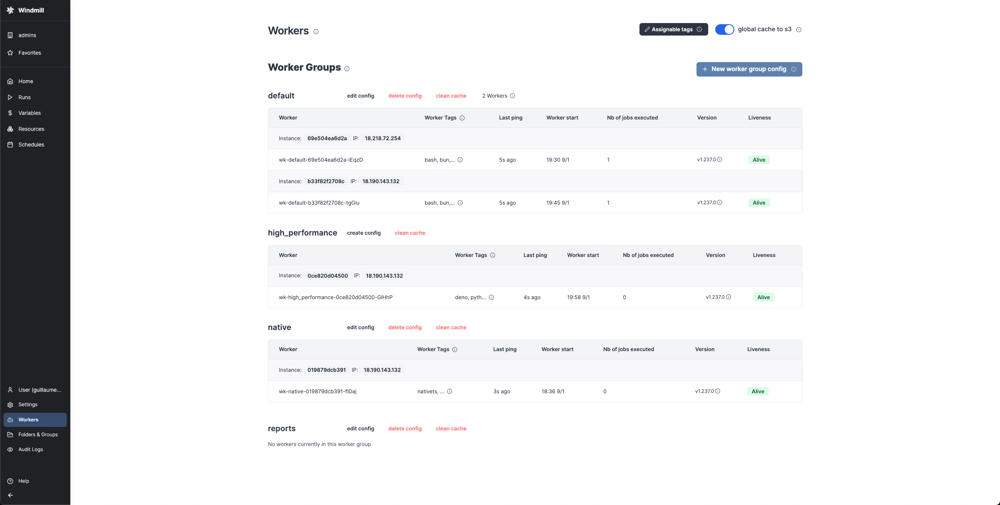

Deploying Windmill on AWS ECS
=============================

This folder contains terraform files to deploy a modular Windmill stack on AWS ECS with just a few commands.

### Pre-requisite

##### AWS terraform user

An AWS user with the AWS managed `AdministratorAccess` policy (arn: `arn:aws:iam::aws:policy/AdministratorAccess`) is necessary. This will be the user terraform uses to deploy the components to AWS.

Generate an AWS access key ID and secret, and append the following block to your `~/.aws/credentials`:

```
[terraform]
aws_access_key_id = <ACCESS_KEY_ID>
aws_secret_access_key = <SECRET_ACCESS_KEY>
```

##### Creating an ecs task execution role

Terraform will reference the role `ecsTaskExecutionRole` to launch tasks in the ECS cluster. SInce it is a common role, this Terraform does not create it, it need to be present in your AWS account.

If it's not, just create it in you IAM console and attach it the following AWS managed policy: `AmazonECSTaskExecutionRolePolicy` (arn: `arn:aws:iam::aws:policy/service-role/AmazonECSTaskExecutionRolePolicy`)

##### Database password

Windmill relies on a PostgreSQL database which will be created by Terraform. The only think you need to manually provide is a strong password. It should be set in [terraform.tfvars](./terraform.tfvars).

### Windmill stack

The following stack will be deployed by this terraform as it is provided:
- 2 Windmill servers (each requiring 1 CPU and 1.5GiB of Memory)
- 2 multi-purpose Windmill workers (each requiring 2 CPU and 3GiB of Memory)
- Windmill LSP (requiring 1 CPU and 1.5GiB of Memory)
- Windmill Multiplayer (requiring 1 CPU and 1.5GiB of Memory)
- 1 native Windmill worker (requiring 2 CPU and 3GiB of Memory)
- 1 high performance Windmill worker (requiring 4 CPU and 15GiB of Memory)

The ECS cluster will be composed of 1 autoscaling group composed of up-to 6 `t3.medium` instances (5 necessary for the entire load, and 1 more for rolling upgrades). This will host all the services except the high performance workers. Those will be deployed on a separate auto-scaling group composed of up-to 2 `t3.xlarge` instances.

Of course the above is provided as an example, it should be tuned for you own needs, both in terms of instance specs, but also in terms of service architecture. For example, you might not need high performance workers, in which case you won't need the second autoscaling group at all. Same for the native worker, multiplayer, or even LSP (though LSP is highly recommended for a better coding experience).

The only strictly required components are:
- At least 1 Windmill server
- At least 1 multi-purpose Windmill worker

This terraform has been assembled to easily remove components. Each component mentioned in the above list is entirely contained in a `.tf` file. If you don't want it, just remove the file. And if you want to tune it, you know where to look.

- _REQUIRED_ Windmill server -> [windmill_server.tf](./windmill_server.tf)
- _REQUIRED_ Multi-purpose windmill worker -> [windmill_worker_basic.tf](./windmill_worker_basic.tf)
- _OPTIONAL_ Windmill LSP -> [windmill_lsp.tf](./windmill_lsp.tf)
- _OPTIONAL_ Windmill Multiplayer -> [windmill_multiplayer.tf](./windmill_multiplayer.tf)
- _OPTIONAL_ Windmill Native worker -> [windmill_worker_native.tf](./windmill_worker_native.tf)
- _OPTIONAL_ Windmill High Performace worker -> [windmill_worker_high_performance.tf](./windmill_worker_high_performance.tf) - this one is a lot longer because it deploys a new auto scaling group

### Network

The network deployed here is a single VPC, composed on 4 subnets spread across 2 availability zones (1 public and 1 private subnet per zone). All the services are behind a load balancer routing the request to Windmill server, LSP or multiplayer.

A single security group is used, allowing HTTP traffic on port 80 (it is not deploying custom certificates and therefore does not use HTTPS).

All this is provided as an example. It can be refined depending on your needs. All the network components are defined in [vpc.tf](./vpc.tf), except the security group which is is [security_group.tf](./security_group.tf) and load balancer which is defined in [load_balancer.tf](./load_balancer.tf)

### RDS Database

Windmill heavily relies on PostgreSQL database. This terraform deploys a standalone RDS instance having 100GiB of storage, which can be scaled up to 1000GiB. For production use cases, we recommend deploying a Multi-AZ instance, or even a Multi-AZ DB cluster. The RDS definition is in [rds.tf](./rds.tf)

### Ready?

REMINDER: don't forget to edit [terraform.tfvars](./terraform.tfvars) before deploying the stack.

Once you're ready, simply run:

```bash
# for a dry-run
terraform plan
```

and then 
```bash
terraform apply
```

