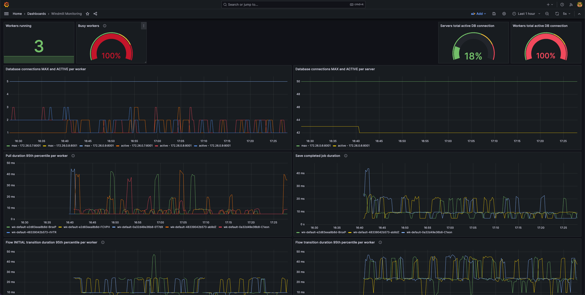

Windmill monitoring with Prometheus
===================================

## Intro

Windmill servers and workers both produces metrics Prometheus can scrap.

Individual jobs producing their own metric can be difficult to achieve due to the ephemeral nature of a job. Prometheus might not have the time to scrape the metric if the job is too quick. Prometheus has developed the [Prometheus Gateway](https://prometheus.io/docs/practices/pushing/) exactly for this usecase, and we're going to go through the initial setup. By the end of this example, you'll have a Windmill stack running a job that produces its own metric, and a Grafana simple dashboard displaying it.

Prometheus push gateway is hosted in [this repository](https://github.com/prometheus/pushgateway)

## Setup

First, we need to setup an entire stack composed of:
- Windmill: a database, a server, and at least one worker
- Prometheus: the server (if you don't already have one), and the gateway to which metrics will be pushed
- Grafana to visualize the metrics (optional)

We have assembled a docker compose with all those services. You can run it with a simple:
```bash
docker compose up -d
```
Once all the services are running, Windmill can be accessed at http://localhost:8000, Prometheus at http://localhost:9090, Grafana at http://localhost:3000 (credentials are set in [grafana.ini](./grafana/grafana.ini) config file).

The Gateway exposes the metrics on http://localhost:9091/metrics and also has an interface at http://localhost:9091 to manage metric groups (see the Gateway documentation for what a metric group is). You can check that Prometheus can collect them directly on [Prometheus status page](http://localhost:9090/targets)

## Monitoring Windmill servers and workers

Metrics need to be enabled on Windmill server and workers. They can be enabled only on Windmill Enterprise Edition by setting the environment variable `METRICS_ADDR` to `1` on each container or toggle on "Expose Metrics" in instance settings -> core (additional "debug-level" metrics can be enabled in the instance settings > debug menu).

Once metrics are enabled, Prometheus needs to discover Windmill service containers. Using docker-compose, it requires a few adjustments:
- Each Windmill containers need to expose the metrics port (`8001` by default) so that Prometheus discovery knows which ports to scrap. This is done by adding the value `8001` to the `expose` block to both `windmill_server` and `windmill_worker`.
- Each Windmill container needs to be labelled so that Prometheus service discovery filters out other services. Here we're using the `prometheus-job=windmill_server` and `prometheus-job=windmill_worker` in the docker compose to differentiate between server and worker
- The Prometheus container needs to have access to the docker socket to discover other containers. To achieve this, Prometheus container needs to be run as root and the docker socket needs to be mounted on the container (see `user: root` and `/var/run/docker.sock:/var/run/docker.sock` in the `prometheus` block of docker-compose.yml) 
- Finally, the following block should be added to `prometheus.yml` config file:

```yaml
scrape_configs:
  - job_name: "windmill_server"
    docker_sd_configs:
      - host: unix:///var/run/docker.sock
    relabel_configs:
      - source_labels: [__meta_docker_container_label_prometheus_job]
        regex: windmill_server
        action: keep
    scrape_interval: 1s

  - job_name: "windmill_worker"
    docker_sd_configs:
      - host: unix:///var/run/docker.sock
    relabel_configs:
      - source_labels: [__meta_docker_container_label_prometheus_job]
        regex: windmill_worker
        action: keep
    scrape_interval: 1s
```

With all this in place, Windmill servers and workers metrics will be scrapped by Prometheus and can be visualized in Grafana. We've added a simple dashboard in [grafana/dashboards/](./grafana/dashboards) showing the most interesting metrics.



Note: If your Windmill containers are split onto multiple docker daemon, the above still works. Instead of pointing to the docker socket in Prometheus' `docker_sd_config` block, simply expose docker daemon to http or https and point to the remote docker daemon host: `http://remote_docker_daemon:2375`. Multiple remote docker daemons can be listed.

## Producing metrics from individual Windmill jobs

Here is an example of how a job can "push" its own metrics to Prometheus via Prometheus Gateway

### Windmill script

Now we will create a script in Windmill that pushes a value to the Prometheus Gateway. We will do it in Python using [prometheus-client](https://github.com/prometheus/client_python), but other clients are available for [Golang](https://github.com/prometheus/client_golang) or [Typescript](https://github.com/siimon/prom-client), and for bash metrics can be pushed via [simple CURL commands](https://github.com/prometheus/pushgateway?tab=readme-ov-file#command-line).

In Windmill, create a new Python script (named `u/admin/random_number_metric_script` in this tutorial) with the following content:

```python
import os
import random
from prometheus_client import CollectorRegistry, Gauge, push_to_gateway

PROMETHEUS_GATEWAY_URL = "prometheus_gateway:9091"

def main():
    job_path = os.environ.get("WM_JOB_PATH")
    registry = CollectorRegistry()
    gauge = Gauge(
        "job_records_processed",
        "Number of records processed for {}".format(job_path),
        registry=registry,
    )
    val = random.randint(0, 100)
    print("Storing metrics value: ", val)
    gauge.set(val)
    push_to_gateway(PROMETHEUS_GATEWAY_URL, job=job_path, registry=registry)
```

It is quite simple. It generate a random number and pushed it via a Gauge metric named `job_records_processed` to the Prometheus Gateway. Note that we use the script path as the `job` label, so that all runs of this script will push to the same metric. Other labels (such as the job ID for example) can also be used via the `grouping_key` argument that `push_to_gateway` accepts.

Once the script is created, you can create a schedule that runs is every 5 seconds for example, such that a new value is pushed regularly.

### Visualizing the metric

If you chose to not run Grafana, the raw metric value can be seen in Prometheus UI directly. Go to http://localhost:9090/graph and input the following in the Expression bar: 
```promql
job_records_processed{exported_job="u/admin/random_number_metric_script"}
```


In Grafana, a similar visualization can be achieved. We've added a dashboard JSON in [grafana/dashboards](./grafana/dashboards/) and the easiest is to import it directly in your Grafana.

The first panel is a simple representation of the `job_records_processed` metric. We've adjusted the `Min Step` to 5 seconds because we know our job runs every 5 seconds and we ideally want to display all the measurement points.


The second panel is here to highlight a limitation to be aware of when using the Prometheus Gateway. It displays the instant value of the `job_records_processed` metric. The main issue with using the Gateway is that the value pushed to it will persist until a new value is pushed. Which means that if the schedule is somehow stopped, or if the script starts failing and stops pushing to Prometheus Gateway, the value will remain constant. It might not be ideal to spot any kind of undesired behavior. Instead what would be nice is to have the metric drop to a default value, like `0`. Thankfully the Gateway comes with a built-in metric called `push_time_seconds` which stores the timestamp of the last successful push for any given metric and label. You can combine the 2 metrics using basic functions to easily create an "instant" representation of signal. This is what we've done in the second panel:


We simply multiply the `job_records_processed` with the `irate` of the `push_time_seconds` metric for the same label, and we set the `Min Step` to `1s` for the `irate` to properly work. 

We obtain the following simple yet useful dashboard:


In between the 2 light blue vertical lines, we manually stopped the Windmill schedule to show that the raw metric (at the top) remains constant, while its instant representation drops to zero.
