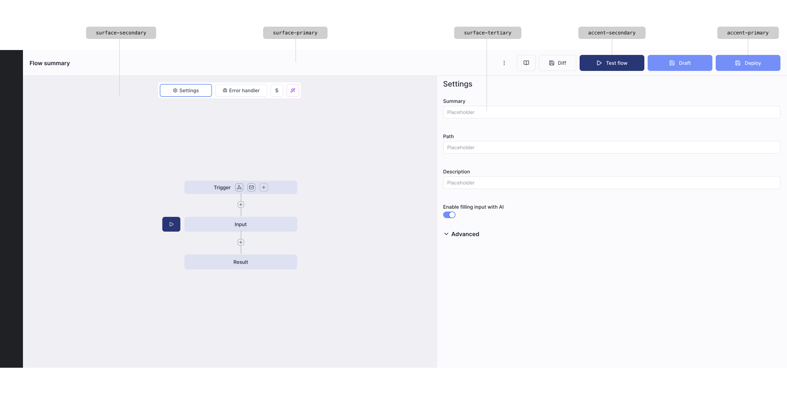

# Windmill Brand Guidelines

_This document contains the complete brand guidelines for Windmill, including visual identity, design system, and communication standards._

# Voice & Communication

This section defines how your brand communicates across all channels and touchpoints.

# Tone of Voice

Your tone of voice should match the serious, professional, no-nonsense character of the product and brand.

## Suggested Content Structure

| **Approach**                                                                  | **✅ Do This**                                          | **❌ Not This**                                         |
| ----------------------------------------------------------------------------- | ------------------------------------------------------- | ------------------------------------------------------- |
| **Direct & Honest** – Say exactly what the product does, no marketing fluff.  | "Deploy complex workflows in minutes."                  | "Experience seamless automation magic."                 |
| **Technical & Precise** – Speak like your audience: developers and engineers. | "Scale scripts without worrying about dependencies."    | "Your team will love our easy drag-and-drop interface." |
| **Confident & Assertive** – Show that the product can handle anything.        | "No limitations. Every workflow is fully customizable." | "Works well for most use cases."                        |
| **Minimalist & Functional** – Avoid unnecessary adjectives or filler words.   |                                                         |                                                         |

# Visual Identity

This section covers all visual elements that make up your brand identity.

## Overview

Visual Identity includes:

- Logo: Usage guidelines, variations, and spacing requirements
- Color System: Primary, secondary, and semantic colors with specifications
- Typography: Font families, hierarchy, and implementation guidelines
  Use the navigation on the left to explore each subsection and add your specific visual identity content.

# Color system

Our color system is designed for **reliability, clarity, and trust**. Windmill is destined to be used by big companies, so colors must convey a sense of professionalism and seriousness. We stay away from vibrant colors in the application interface and use monochromatic tones with purposeful accent colors.

## Design Principles

- **Meaningful, not decorative**: Every color serves a functional purpose
- **Reliability over vibrancy**: Muted tones convey trust and professionalism
- **Context-aware**: Different palettes for app vs marketing contexts
- **Accessible**: All colors meet WCAG AA contrast requirements
- **Consistent**: Systematic approach to color usage across all interfaces

## Color Philosophy

**Colors are meaningful and never decorative.** We distinguish between:

- **App palette**: Less vibrant colors for the core application interface
- **Web palette**: More vibrant colors for marketing and brand recognition
- **Monochromatic scale**: Nord-based neutrals for surfaces and backgrounds

## Color Palette Overview

Our complete color system in action, showing how all color categories work together across light and dark themes:

_Light mode example_

## Accent Colors

The **luminance-blue** is our primary accent color, used throughout the app for interactive elements, active states, and user actions.
_[Color palette display - see original documentation for interactive colors]_
**When to use:**

- Call-to-action buttons
- Active navigation items
- Toggle switches (on state)
- Progress bars
- Interactive links
- Selected states

## Surface Colors

Surface colors create depth and layout structure with clear hierarchy between different interface levels.
_[Color palette display - see original documentation for interactive colors]_

## Text Colors

Text colors provide clear hierarchy and readability across light and dark themes.
_[Color palette display - see original documentation for interactive colors]_

## Border Colors

Border colors define element separation and structure.
_[Color palette display - see original documentation for interactive colors]_

## Feedback Colors

Standard semantic colors for system feedback and status communication.
_[Color palette display - see original documentation for interactive colors]_

## Reserved Colors

These colors are exclusively reserved for specific features and should not be used elsewhere.
_[Color palette display - see original documentation for interactive colors]_
**Usage:**

- AI-powered script generation
- Magic wand icons
- AI assistance features
- Smart suggestions

## Web/Marketing Colors

More vibrant colors used exclusively for marketing materials and the website (not in the core application).
_[Color palette display - see original documentation for interactive colors]_
**Important:** These colors should **never** be used in the core application interface. They are reserved for:

- Marketing website
- Landing pages
- Documentation site headers
- Brand materials
- Social media assets

## Color Reference

Complete color system with usage guidelines, hex values, and Tailwind classes:
**Implementation Rule:** Always use the provided Tailwind classes in your components. Never use hex values directly in styles - this ensures consistency and theme switching compatibility.

```jsx
// ✅ Correct - use Tailwind classes
Save
Content
// ❌ Wrong - don't use hex values
Save
```

## Do's and Don'ts

### ✅ Do

- Use provided Tailwind classes for all color implementations
- Use `accent-primary` sparingly for important actions
- Rely on surface colors for most interface backgrounds
- Apply text colors according to content hierarchy
- Use proper border colors for element separation
- Apply feedback colors consistently for their semantic meaning
- Test color combinations for accessibility compliance
- Reserve AI purple exclusively for AI features
- Follow the defined color token structure

### ❌ Don't

- Use hex values directly in component styles or CSS
- Mix web/marketing colors with app interface colors
- Use AI purple for non-AI features
- Create custom color variations between defined tokens
- Use color alone to convey meaning (pair with icons/text)
- Apply accent colors to large surface areas
- Use marketing blue (`#3B82F6`) in the app interface
- Use `accent-primary` for large backgrounds
- Mix different color token categories inappropriately

### Color-Blind Considerations

- Never use color alone to convey information
- Pair color with icons, text, or patterns
- Test designs with color-blind simulation tools
- Ensure sufficient contrast in monochrome

## Quick Reference

| Token                    | Light Mode | Dark Mode | Tailwind Class             | Usage                                                  |
| ------------------------ | ---------- | --------- | -------------------------- | ------------------------------------------------------ |
| **Accent Colors**        |            |           |                            |                                                        |
| accent-primary           | #758ff8    | #7085db   | `accent-primary`           | Primary accent color for buttons, links, active states |
| accent-hover             | #5074f6    | #5670d5   | `accent-hover`             | Hover state for interactive accent elements            |
| accent-clicked           | #2c5beb    | #425bbd   | `accent-clicked`           | Active/pressed state for accent elements               |
| accent-secondary         | #293676    | #e8ebfb   | `accent-secondary`         | Secondary accent for strong emphasis                   |
| accent-secondary-hover   | #1e255f    | #c3c9df   | `accent-secondary-hover`   | Hover state for accent secondary elements              |
| accent-secondary-clicked | #303f82    | #9da6ca   | `accent-secondary-clicked` | Active/pressed state for accent secondary elements     |
| accent-selected          | #bfdbfe4c  | #6790c44c | `accent-selected`          | Selected state background                              |
|                          |            |           |                            |                                                        |
| **Surface Colors**       |            |           |                            |                                                        |
| surface-primary          | #fbfbfd    | #2e3441   | `surface-primary`          | Main application background                            |
| surface-secondary        | #efeff4    | #272c35   | `surface-secondary`        | Secondary backgrounds, sections                        |
| surface-tertiary         | #ffffff    | #353c4a   | `surface-tertiary`         | Cards, modals, elevated surfaces                       |
| surface-hover            | #cfcfe233  | #7784a119 | `surface-hover`            | Hover states for neutral elements                      |
| surface-selected         | #ffffff    | #434c5e   | `surface-selected`         | Selected neutral elements                              |
| surface-disabled         | #d8d8e433  | #212732   | `surface-disabled`         | Disabled elements, inactive states                     |
| surface-sunken           | #e8e8ef    | #242832   | `surface-sunken`           | Sunken or inset surfaces                               |
| surface-input            | #ffffff    | #292e38   | `surface-input`            | Input field backgrounds                                |
|                          |            |           |                            |                                                        |
| **Text Colors**          |            |           |                            |                                                        |
| text-primary             | #3d4758    | #d4d7dd   | `text-primary`             | Default text, body content                             |
| text-emphasis            | #1d2430    | #eeeff2   | `text-emphasis`            | Headers, labels, emphasized content                    |
| text-secondary           | #718096    | #a9b0ba   | `text-secondary`           | Supporting information, metadata                       |
| text-tertiary            | #505c70    | #a8aeb7   | `text-tertiary`            | Subtle text, captions                                  |
| text-hint                | #8d93a1    | #8d93a1   | `text-hint`                | Placeholders, tooltips, hints                          |
| text-disabled            | #a0aec0    | #9098a2   | `text-disabled`            | Disabled states, unavailable options                   |
| text-accent              | #5074f6    | #c7cefc   | `text-accent`              | Accent colored text, links                             |
|                          |            |           |                            |                                                        |
| **Border Colors**        |            |           |                            |                                                        |
| border-light             | #e5e7eb    | #374457   | `border-light`             | Subtle borders, dividers                               |
| border-normal            | #9ca3af    | #a9b0ba   | `border-normal`            | Standard borders, form inputs                          |
| border-accent            | #2c5beb    | #a0affa   | `border-accent`            | Accent borders, focus states                           |
| border-selected          | #a0affa    | #6475b7   | `border-selected`          | Selected element borders                               |
|                          |            |           |                            |                                                        |
| **Reserved Colors**      |            |           |                            |                                                        |
| ai-primary               | #a02cde    | #f0c6fb   | `ai-primary`               | AI features, magic wand icon, AI-powered functionality |
|                          |            |           |                            |                                                        |
| **Feedback Colors**      |            |           |                            |                                                        |
| success                  | #22c55e    | #22c55e   | `green-500`                | Success states, positive feedback, completed actions   |
| warning                  | #eab308    | #eab308   | `yellow-500`               | Warning states, caution messages, pending actions      |
| error                    | #ef4444    | #ef4444   | `red-500`                  | Error states, failed actions, destructive operations   |
| info                     | #3b82f6    | #3b82f6   | `blue-500`                 | Information states, neutral notifications              |
|                          |            |           |                            |                                                        |

Remember: **Colors are meaningful, not decorative.** Every color choice should serve a clear functional purpose in the user interface.

# Elevation

Windmill uses a **minimal elevation system** based on surface colors and strategic shadows. We prioritize clarity and simplicity over complex layering effects.

## Elevation Principles

- **Surface colors create depth**: Darker surfaces appear deeper than lighter ones
- **Shadows only for overlays and movement**: Not for making elements stand out
- **Light borders for grouping**: Preferred over shadows for content separation
- **Use sparingly**: Limit elevation to avoid visual noise

## Surface Depth System

We use surface colors from our color system to create depth hierarchy:

- **`surface-primary`** (#FBFBFD): Default elevation, main backgrounds
- **`surface-secondary`** (#EFEFF4): Sunken surfaces, recessed areas
- **`surface-tertiary`** (#FFFFFF): Elevated cards and content areas

## Shadow Usage

### When to Use Shadows

**✅ Use shadows for:**

- **Overlays**: Modals, dropdowns, tooltips (`shadow-lg`)
- **Moving elements**: Drag and drop, active states (`shadow-md`)
  **❌ Don't use shadows for:**
- Making buttons or elements stand out
- Content grouping or separation
- Decorative purposes
- Permanent interface elements

### Shadow Specifications

- **`shadow-md`**: For moving elements and temporary elevation
- **`shadow-lg`**: For overlays and floating content
- **Light borders**: `border-light` (#E5E7EB) for grouping instead of shadows

## Examples

### Overlay Elevation

Modals, dropdowns, and floating content use `shadow-lg` with light borders:


### Sunken Surface

Recessed areas use `surface-secondary` to appear deeper than the main background:


## Do's and Don'ts

### ✅ Do

- Use `surface-secondary` for sunken or recessed areas
- Apply `shadow-lg` only to overlays (modals, dropdowns)
- Use `shadow-md` for elements being moved or dragged
- Prefer light borders (`border-light`) for content grouping
- Keep elevation simple and purposeful
- Use `surface-tertiary` for elevated cards when needed

### ❌ Don't

- Use shadows to make buttons or static elements stand out
- Combine multiple elevation techniques unnecessarily
- Create custom shadow values outside the system
- Use elevation purely for decoration
- Apply heavy shadows that distract from content
- Overuse elevation effects throughout the interface
  Remember: **Elevation should enhance usability, not create visual complexity.** When in doubt, use surface colors instead of shadows for depth.

# Typography

Our typography system is designed for **clarity, efficiency, and minimalism**. With limited screen space in a complex developer tool, we prioritize readability and information density over decorative hierarchy.

## Design Principles

- **Space-efficient**: Default to 12px for body text to maximize content visibility
- **Minimal hierarchy**: Only 3 header levels to avoid confusion
- **Weight over size**: Use font-weight to create hierarchy, not excessive size changes
- **Functional**: Every style has a clear, specific purpose

## Font Family

We use **Inter** for all UI text due to its excellent readability at small sizes and professional appearance.
For technical content (IDs, code snippets, JSON), use the system **monospace** font.

## Text Colors

_[Color palette display - see original documentation for interactive colors]_

### Color Philosophy

We use a **lighter default** with a **darker emphasis option** to:

- Reduce eye strain during extended use
- Create clear visual hierarchy without relying on size
- Make emphasized content truly stand out
- Align with modern developer tool aesthetics
  **Key principle:** Use `text-primary` for most content, reserve `text-emphasis` for true importance.

## Type Styles

### Typography Scale Overview

### App Page Title

**When to use**: Main application page titles, primary navigation headings

```tsx
class = 'font-semibold text-2xl text-emphasis';
```

- **Size**: 24px (`text-2xl`)
- **Weight**: 600 (`font-semibold`)
- **Color**: `text-emphasis`
- **Example**: "Job Orchestrator", "Flow Builder", "Resource Manager"

---

### Page Title

**When to use**: Top-level page headings, modal titles, main view names

```tsx
class = 'text-lg font-semibold text-emphasis';
```

- **Size**: 18px (`text-lg`)
- **Weight**: 600 (`font-semibold`)
- **Color**: `text-emphasis`
- **Example**: "Job Orchestrator Dashboard", "Edit Flow Configuration"

---

### Section Header

**When to use**: Panel headers, card titles, collapsible section names, sidebar groups

```tsx
class = 'text-sm font-semibold text-emphasis';
```

- **Size**: 14px (`text-sm`)
- **Weight**: 600 (`font-semibold`)
- **Color**: `text-emphasis`
- **Example**: "Active Jobs", "Configuration", "Environment Variables"

---

### Body

**When to use**: Default text throughout the application - descriptions, content, list items, table cells

```tsx
class = 'text-xs font-normal text-primary';
```

- **Size**: 12px (`text-xs`)
- **Weight**: 400 (`font-normal`)
- **Color**: `text-primary`
- **Example**: Form descriptions, paragraph content, dialog text
  **This is your default**. When in doubt, use this style.

---

### Body Emphasized

**When to use**: Important labels, form field labels, tab labels, emphasis within body text

```tsx
class = 'text-xs font-semibold text-emphasis';
```

- **Size**: 12px (`text-xs`)
- **Weight**: 600 (`font-semibold`)
- **Color**: `text-emphasis`
- **Example**: "Job Name:", "Status:", button labels

---

### Secondary Text

**When to use**: Supporting information, metadata, timestamps, status descriptions

```tsx
class = 'text-xs font-normal text-secondary';
```

- **Size**: 12px (`text-xs`)
- **Weight**: 400 (`font-normal`)
- **Color**: `text-secondary`
- **Example**: "Last run 2 hours ago", "Created by John Doe", file sizes

---

### Caption

**When to use**: Helper text below inputs, table column headers, inline annotations, badges

```tsx
class = 'text-2xs font-normal text-secondary';
```

- **Size**: 11px (`text-2xs`)
- **Weight**: 400 (`font-normal`)
- **Color**: `text-secondary`
- **Example**: "Optional field", "Max 100 characters", column headers

---

### Hint

**When to use**: Input placeholders, tooltip content, empty state messages, subtle guidance

```tsx
class = 'text-2xs font-normal text-hint';
```

- **Size**: 11px (`text-2xs`)
- **Weight**: 400 (`font-normal`)
- **Color**: `text-hint`
- **Example**: "Enter job name...", "Search flows", tooltip text

---

### Code/Monospace

**When to use**: Job IDs, code snippets, file paths, API endpoints, JSON keys, technical identifiers

```tsx
class = 'text-2xs font-mono font-normal text-emphasis';
```

- **Size**: 11px (`text-2xs`)
- **Weight**: 400 (`font-normal`)
- **Color**: `text-emphasis`
- **Font**: System monospace
- **Example**: `job_id_12345`, `/api/v1/jobs`, `ENV_VAR_NAME`
  **Note**: Use `text-emphasis` for code to ensure technical values stand out and are easily scannable.

---

## Usage Guidelines

### Creating Hierarchy

Use these methods in order of preference:

1. **Font weight** - Semibold (600) for headers and emphasis, normal (400) for body
2. **Color** - Primary for main content, secondary for supporting info, hint for subtle guidance
3. **Size** - Only change size for true hierarchy levels (page title vs section header vs body)
   **Don't** create hierarchy by:

- Making text larger than 24px (except for App Page Titles)
- Using more than 3 header levels
- Adding excessive spacing or borders

## Creating Visual Hierarchy - Priority Order

1. **Font Weight** - Use semibold (600) for emphasis
2. **Color** - Use textEmphasis for important content
3. **Position & Spacing** - Group related content, add white space
4. **Size** - Only use defined type styles, never custom sizes

### ❌ Don't

- Increase font size to make something "stand out"
- Create one-off font sizes for special cases
- Use large headers in dense UI areas

### ✅ Do

- Use font-weight to emphasize within the same size
- Use textEmphasis color for important content
- Add spacing around important elements

## Text Casing

### Primary Rule: Use Sentence Case

Use sentence case for all UI text—capitalize only the first word and proper nouns. This approach improves readability and is faster to implement consistently.
**Examples:**

- ✅ "Create new flow"
- ✅ "Edit Windmill resource"
- ❌ "Create New Flow"
- ❌ "SAVE CHANGES"

### Casing by Component Type

**Page titles and headings**

- Use sentence case: "Job orchestrator dashboard"
  **Buttons and actions**
- Use sentence case: "Save changes", "Delete job"
  **Form labels**
- Use sentence case: "Job name", "Resource type"
  **Navigation items**
- Use sentence case: "User settings", "Resource manager"
  **Error messages and notifications**
- Use sentence case: "Job completed successfully"

### Always Capitalize

- **Proper nouns**: Windmill, Docker, Python, GitHub
- **Acronyms**: API, HTTP, JSON, SQL
- **First word** of any sentence or UI element

### Special Cases

- **Technical identifiers**: Keep original casing (`job_id_123`, `ENV_VAR`)
- **Brand names**: Follow brand guidelines (iPhone, macOS)
- **Abbreviations**: Use standard forms (ID, URL, vs.)

### Accessibility Note

Avoid ALL CAPS text except for very short labels (2-3 characters max). All caps text is slower to read and can appear aggressive to users.

## Decision Tree

Not sure which style to use? Follow this:
Is it a main application page title?
→ **Yes**: App Page Title (24px, semibold)
→ **No**: Continue
Is it a page or modal title?
→ **Yes**: Page Title (18px, semibold)
→ **No**: Continue
Is it a section/panel header?
→ **Yes**: Section Header (14px, semibold)
→ **No**: Continue
Is it technical data (ID, code, path)?
→ **Yes**: Code/Monospace (11px, mono)
→ **No**: Continue
Is it a placeholder or tooltip?
→ **Yes**: Hint (11px, hint color)
→ **No**: Continue
Is it helper text or a table header?
→ **Yes**: Caption (11px, secondary color)
→ **No**: Continue
Is it metadata or supporting info?
→ **Yes**: Secondary Text (12px, secondary color)
→ **No**: Continue
Is it a label or needs emphasis?
→ **Yes**: Body Emphasized (12px, semibold weight, emphasis color)
→ **No**: Body (12px, normal, primary color) ← **DEFAULT**

## Accessibility

- All text colors meet contrast requirements on standard backgrounds
- Never use font size alone to convey meaning
- Ensure disabled text (`text-disabled`) is paired with visual disabled states

## Common Mistakes

❌ **Don't** create custom font sizes between defined styles
✅ **Do** use the defined type styles
❌ **Don't** use Section Header inside table cells
✅ **Do** use Caption for table headers
❌ **Don't** use Body Emphasized everywhere for "importance"
✅ **Do** reserve it for labels and truly emphasized content
❌ **Don't** make job IDs or code bold/colored
✅ **Do** use monospace font with text-emphasis for technical identifiers
❌ **Don't** use text-emphasis for body paragraphs
✅ **Do** use text-primary for most content, text-emphasis for headers/labels

# Design System

This section covers the complete design system including components, layouts, and interaction patterns.

## Overview

Design System includes:

- Iconography: Icon library and usage guidelines
- Spacing & Grid: Layout fundamentals and spacing scales
- Components: Reusable UI components and specifications
- Layout: Page structure and content organization principles
  Use the navigation on the left to explore each subsection and add your specific design system content.

# Components

## Core Rules

### 1. Always Use the Component Library

**Never create custom components.** Use only the provided components from Windmill's library. If you need functionality that doesn't exist, request it from the design system team.

### 2. No Style Hacking

**Do not override component styles.** Components provide props for all supported variants and configurations. If you need a different appearance, use the appropriate prop variant.

```jsx
// ✅ Correct - use provided variants
// ❌ Wrong - don't add custom styles
```

### 3. Check Guidelines First

**Always consult these component guidelines** before implementing. Each component section specifies:

- When to use each variant
- Proper implementation patterns
- Accessibility requirements
- Common mistakes to avoid

## Quick Reference

### Before You Code

1. Check if a component exists for your use case
2. Read the component's specific guidelines
3. Use only the documented props and variants
4. Test accessibility with keyboard navigation

## Buttons

Windmill uses **4 button types** with clear hierarchy. Each button type comes in 3 variants (text, icon+text, icon-only) and supports multiple states including hover, active, disabled, and selected (default and subtle only).
**Button Hierarchy:**

- **Accent Secondary** (Highest Priority): Main conversion CTAs on landing pages - "Sign up", "Get started", "Download"
- **Accent** (High Priority): Most important action per view - "Save", "Submit", "Create" (only one per screen)
- **Default** (Standard Priority): Secondary actions and most UI interactions - "Cancel", "Edit", "Delete"
- **Subtle** (Low Priority): Tertiary actions in dense interfaces - toolbars, button groups
  **Button States:**
- **Default**: Standard button appearance
- **Hover**: Interactive feedback when cursor hovers over button
- **Active/Pressed**: Visual feedback when button is clicked or pressed
- **Disabled**: Non-interactive state for unavailable actions
- **Selected**: Active selection state (available only for Default and Subtle variants)
  **Usage Rules:**
- ✅ Use appropriate hierarchy, provide tooltips for icon-only buttons, test all states including disabled and selected
- ❌ Don't use multiple Accent buttons per view, use Accent Secondary outside marketing, create custom styles, or use selected state on Accent variants

## Implementation Notes

When implementing any component:

1. **Follow the design system**: Use only the components and variants documented here
2. **Accessibility first**: All components include built-in accessibility features
3. **Test thoroughly**: Verify functionality across different states and themes
4. **Ask questions**: When in doubt, consult the design system team before creating custom solutions

# Iconography

We use the **[Lucide icon library](https://lucide.dev/)** to ensure a consistent, modern, and lightweight visual language. Icons are line-only, aligning with our clean and technical aesthetic.

## Do's and Don'ts

### ✅ Do

- Use Lucide icons consistently throughout the interface
- Maintain the original 2px stroke width and style
- Use semantic colors from our color system
- Pair icons with text labels when possible
- Use standard sizes (16px, 20px, 24px, 32px)
- Ensure sufficient contrast for accessibility

### ❌ Don't

- Mix different icon libraries or styles
- Modify the stroke width or visual style
- Use icons as pure decoration without function
- Use icons alone for complex or uncommon actions
- Scale icons to arbitrary sizes
- Create custom icons unless absolutely necessary
  Icons should enhance usability and clarity, not complicate the interface. When in doubt, prioritize clear text labels over icons alone.

# Layout

Our layout system ensures **consistency, clarity, and usability** across all interfaces. These guidelines establish standardized patterns for organizing content and interface elements.

## Form

Forms are fundamental building blocks of our application. They should be clear, efficient, and follow consistent patterns to reduce cognitive load and improve user experience.

### Design Principles

- **Predictable structure**: Consistent vertical hierarchy helps users scan and complete forms efficiently
- **Clear communication**: Every element serves a purpose in guiding users toward successful completion
- **Minimal cognitive load**: Use established patterns and clear visual hierarchy
- **Accessible by default**: Follow semantic HTML and proper labeling conventions

### Vertical Layout Guidelines

All form elements follow a consistent top-to-bottom hierarchy:
**Label → Description → Input → Validation/Hint**
This predictable order allows users to quickly understand what information is needed and how to provide it correctly.

### Spacing Guidelines

Use consistent spacing to create clear relationships between form elements:

- **4px gap (`gap-y-1`)** between all adjacent form elements:
- Label to Description
- Description to Input
- Input to Validation/Hint
  This tight, consistent spacing groups related elements while maintaining clear separation between form fields.

### Typography Guidelines

Follow our established [typography system](../../visual_identity/3_typography/index.mdx) for form elements:

#### Label

- **Style**: Body emphasized (`text-xs font-semibold text-emphasis`)
- **Purpose**: Clearly identify what information is required
- **Example**: "Job name:", "Resource type:", "Environment variables:"

#### Description

- **Style**: Body (`text-xs font-normal text-secondary`)
- **Purpose**: Provide additional context or instructions
- **Example**: "Choose a descriptive name for your automation job"

#### Validation/Hint

- **Style**: Caption (`text-2xs font-normal text-hint`)
- **Purpose**: Guide users with requirements or feedback
- **Example**: "Required field", "Must be at least 8 characters", "Optional field"

### Writing Guidelines

#### Descriptions

- Keep descriptions concise and actionable
- Focus on the outcome or benefit, not the technical process
- Use sentence case and avoid unnecessary punctuation
- Example: ✅ "Choose the Python version for your script execution" vs ❌ "This dropdown allows you to select which Python version will be used when executing your script."

#### Helper Text and Hints

- Be specific about requirements upfront
- Use positive language when possible
- Provide examples for complex inputs
- Example: ✅ "Use lowercase letters, numbers, and hyphens only" vs ❌ "Invalid characters not allowed"

### Tooltip Usage

Use tooltips sparingly for **additional context** that would otherwise clutter the interface:

- Complex terminology or concepts that need definition
- Background information that helps with decision-making
- Links to relevant documentation or resources
  **Don't use tooltips for**:
- Essential information needed to complete the form
- Error messages or validation feedback
- Basic instructions that should be in the description

### Visual Example


_Light mode example_

### Implementation Notes

- Always include proper semantic HTML (`, `, etc.)
- Associate labels with inputs using `for` attributes or wrapping
- Maintain consistent spacing using Tailwind's `gap-y-1` utility
- Test form layouts across different viewport sizes
- Ensure sufficient color contrast for all text elements

# Spacing & Layout

Windmill uses **Tailwind CSS spacing utilities** and **flex containers** to create consistent, responsive layouts across all interfaces.

## Spacing Scale

Our spacing system follows **Tailwind's default spacing scale** based on 4px increments:

- **`space-1`** (4px): Micro spacing between related elements
- **`space-2`** (8px): Base unit for component padding and margins
- **`space-4`** (16px): Standard spacing between components
- **`space-6`** (24px): Section spacing and larger gaps
- **`space-8`** (32px): Page margins and major sections
- **`space-12`** (48px): Large spacing for visual breaks
- **`space-16`** (64px): Maximum spacing for major layout divisions

## Layout System

We use **Tailwind's flex utilities** for responsive layouts:

- **Flex containers**: `flex flex-col` or `flex flex-row` for layout direction
- **Spacing**: `space-x-4` and `space-y-4` for consistent gaps between elements
- **Max width**: `max-w-6xl` (1152px) for content areas

## Do's and Don'ts

### ✅ Do

- Use Tailwind spacing utilities (`p-4`, `m-6`, `space-x-4`) for all measurements
- Use flex responsive classes (`flex-col md:flex-row`, `justify-between`)
- Apply consistent container patterns (`container mx-auto px-8`)
- Use `space-x-*` and `space-y-*` for gaps between flex items
- Leverage Tailwind's responsive breakpoints (`sm:`, `md:`, `lg:`, `xl:`)

### ❌ Don't

- Use arbitrary spacing values with square brackets `[32px]`
- Mix CSS spacing with Tailwind utilities in the same component
- Use fixed pixel values instead of responsive utilities
- Break responsive design patterns with custom CSS
