# CHANGELOG

This article documents the changes from Svelvet5 to Svelvet6. It is for internal use.

## custom-nodes

https://www.svelvet.io/docs/custom-nodes/

Anchor points no longer display on nodes in isolation. This is because anchor points are no longer tied to the node object.

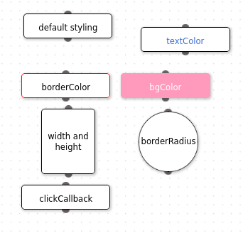
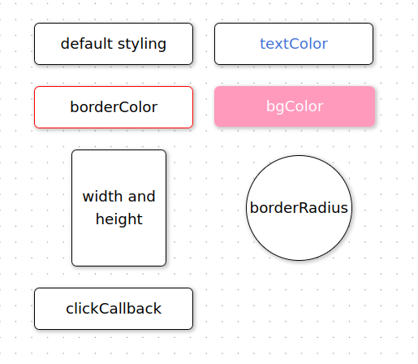

## custom-edges

https://www.svelvet.io/docs/custom-edges/

Edges now use adaptive anchors by default. Previously, source/target anchors were placed on the top/bottom of the node by default. It looks nice in the specific causes when target nodes are located below source nodes, but in the general case there will be intersecting edges.

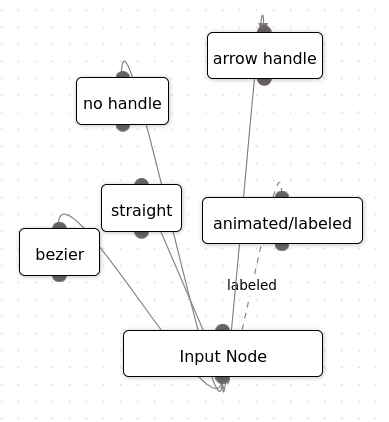
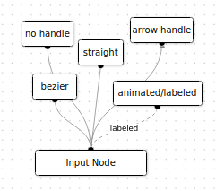

## panning and zooming

https://www.svelvet.io/docs/pan-and-zoom/

Panning and zooming is functional. Removed option to stop panning, lock nodes due to store pollution. This is simple to add back if it is a community requested feature.

TODO: need to update this text in docs:

```
play around with the flow diagram below! If you wish to stop panning, set the movement prop to false. If you wish to stop node dragging, pass in the locked prop.
```

## usage with typescript

https://www.svelvet.io/docs/typescript/

Type names changed from Node, Edge ,to UserNodeType, UserEdgeType. The main reason for this is:

- The internal state of Svelvet is stored in objects Node, Edge which are different from the specifications passed in by users (hereafter referred to as UserNode, UserEdge). For example, UserNodes have "sourcePosition" and "targetPosition" parameters. However, the internal node project does not have "sourcePosition" and "targetPosition"; instead that functionality has been abstracted to a separate Anchor class. This promotes greater code modularity.

## CSS-Background

https://www.svelvet.io/docs/CSS-Background/

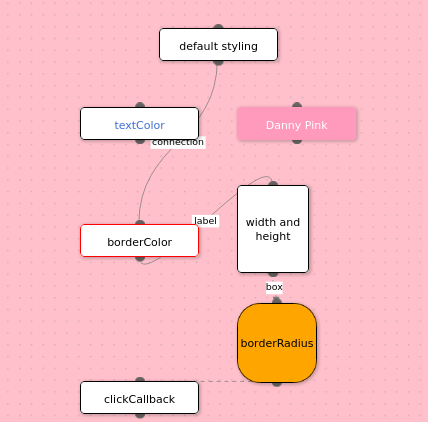
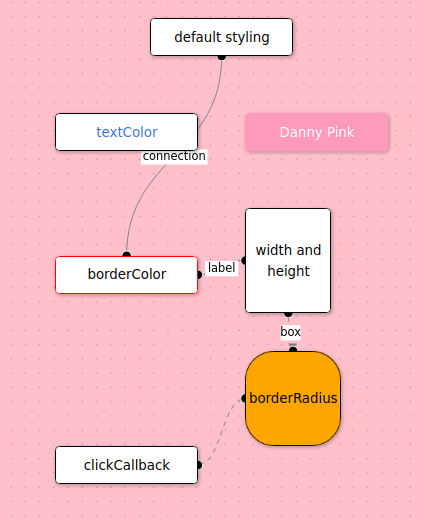

No visual changes. Moved background color out of store in order to minimize store pollution. This means that background color will not be serialized using the import-export-store feature. We talk more about this later in import-export-store section.

## node-grouping

https://www.svelvet.io/docs/node-grouping/

No change in functionality.

## snap-to-grid

https://www.svelvet.io/docs/snap-to-grid/
http://localhost:3000/compatability-8-snap-to-grid/

No change in functionality

## html-docs

https://www.svelvet.io/docs/snap-to-grid/
http://localhost:3000/compatability-8-snap-to-grid/

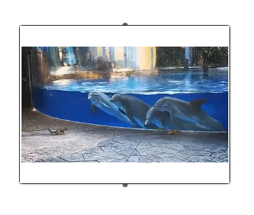
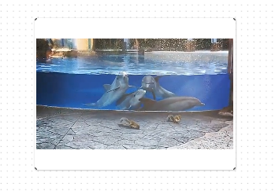

no change in functionality

## node-create

https://www.svelvet.io/docs/Interactive-Nodes/
http://localhost:3000/compatibility-10-node-create/

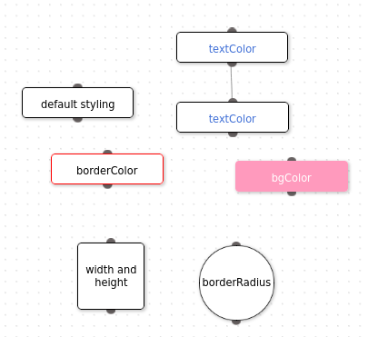
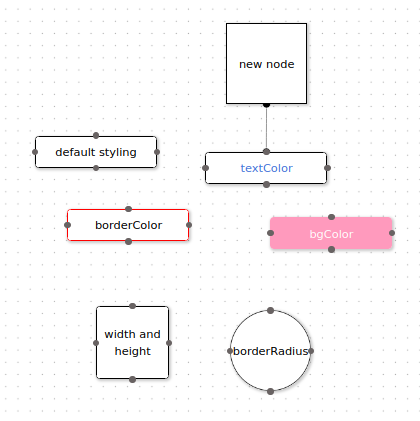

- Previously, the new node inherits from the old node. Now, the new node is created with default parameters. Note that we have functionality to edit nodes.
- edge creation works the same as before (not shown)
- there are now 4 potential anchor points, rather than one source / on target anchor point.

## custom-svelte-components

https://www.svelvet.io/docs/Custom-Svelte/
http://localhost:3000/compatibility-11-custom-svelte-components/

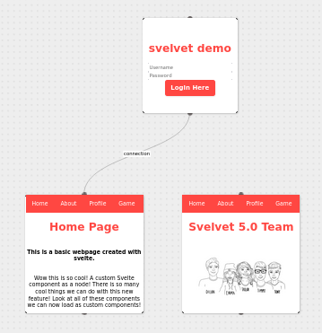
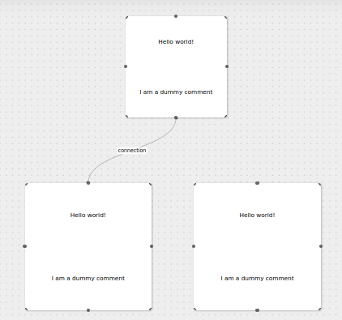

Same functionality as before. The reason why it looks different is because I created my own dummy Svelte component to test.

## Minimap

http://localhost:3000/compatibility-12-minimap/
https://www.svelvet.io/docs/Minimap/

Same functionality as before. It looks like there is a big with HTML feature (unrelated to minimap)

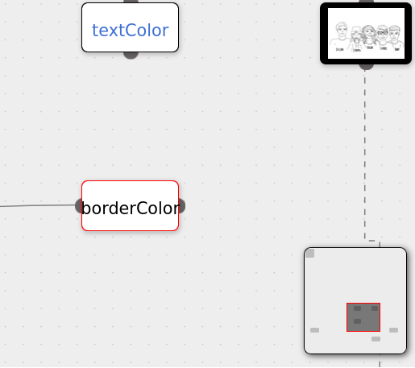
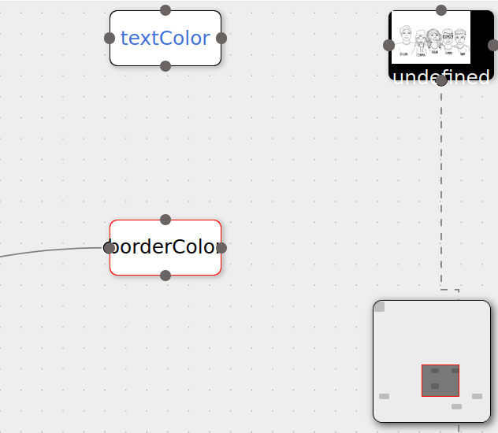

## Initial zoom and location

Same functionality as Svelvet5. It appears the center of the canvas is 0,0

## node classes

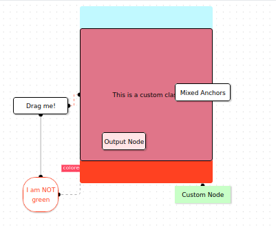


You need to put !important in the CSS

## ImportDiagrams

https://www.svelvet.io/docs/importDiagrams/
http://localhost:3000/featureImportExport/

Feature works as expected. Note that previous version of Svelvet did not serialize callbacks (there is no general way to do this since callbacks can involve closures). We do not do serialize callbacks in Svelvet6; this includes anchors which are reset to adaptive upon serialization.

As before, any canvas-wide parameters (such as nodeCreate, backgroundColor, etc.) will not be serialized.

This feature is fragile since there is no guarantee that it will work with new features involving nodes and edges. In order to future-proof this feature, it would be best to specify that import/export of diagrams only serializes certain parameters.

## Diagram Boundary

http://localhost:3000/compatibility-15-diagramBoundary/
https://www.svelvet.io/docs/boundary/

Feature works as expected

## Iteractive Editable nodes

http://localhost:3000/compatibility-16-nodeEdit/
https://www.svelvet.io/docs/editNodes/

Feature works as expected. NodeEdit is now active by default. This is to reduce store pollution. In addition, node edit chaning width/height of nodes has been removed because this functionality is duplicated by resizableNodes

## Deletable nodes

This feature has been removed to reduce feature bloat. Its functionality is duplicated by Interactive Editable nodes feature.
